# Protheus-adm

## Instalação SQL 2019

Execução padrão do instalador:

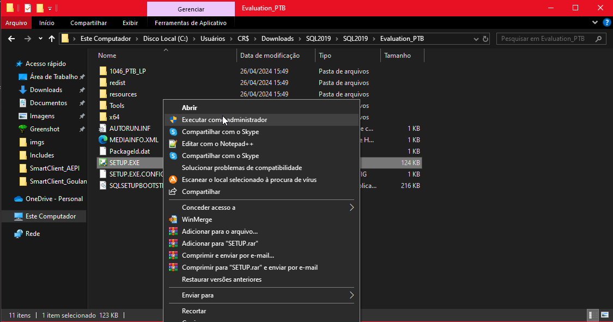

Primeira execução:

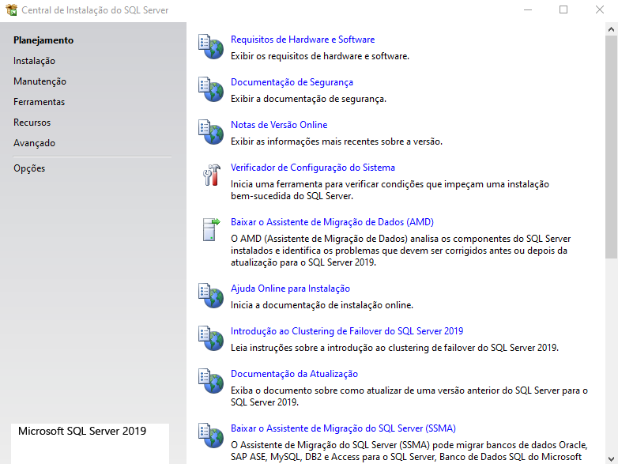

Abertura aba "Instalação":

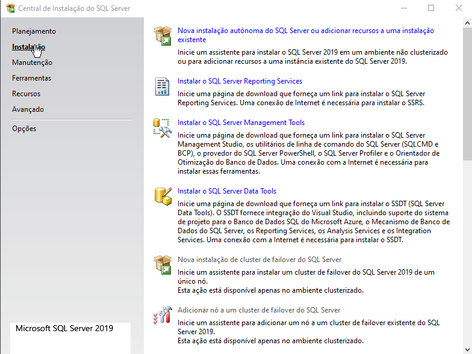

Abertura aba "Instalação":

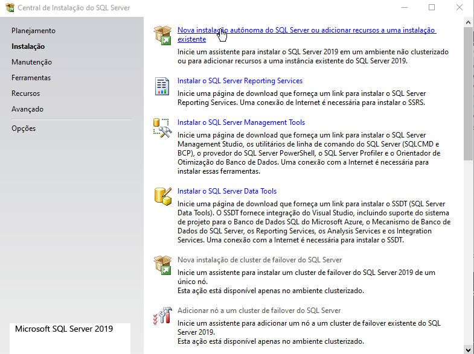

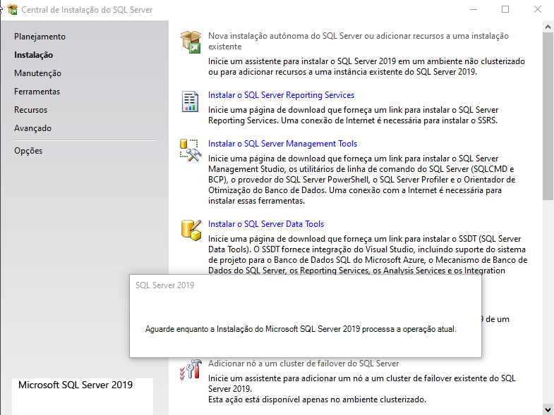

Instalação "SQL Server Management Tools":
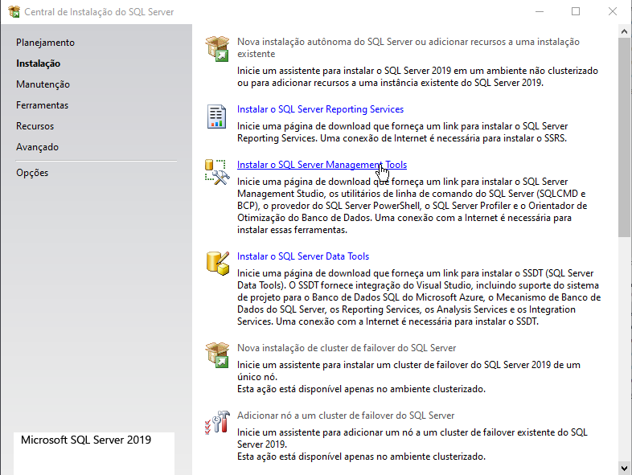

## Configuração SQL 2019

- Selecionar opção **"Developer"** e clicar sobre **"Avançar"**
  - Aceitar os termos de licença e clicar sobre **"Avançar"** novamente

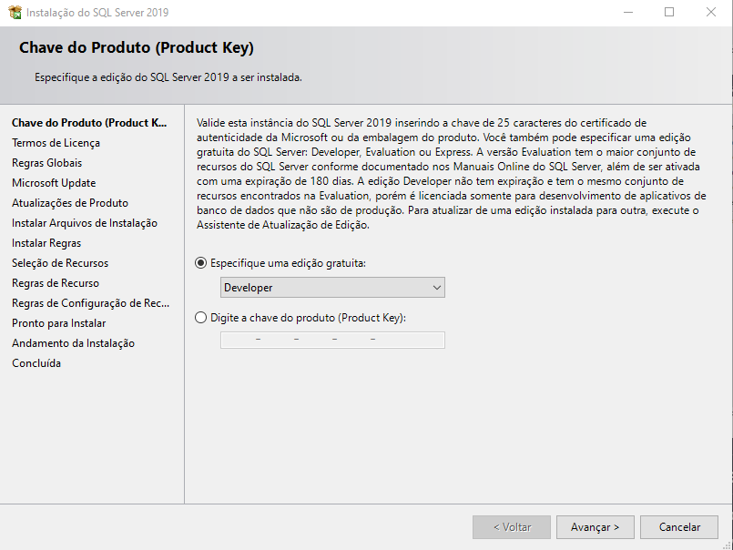

- Ao chegar na tela de **"Relação de Recursos"**, selecione a opção **"Serviços de Mecanismo de Banco de Dados"**, em baixo o local de instalação será mantido.

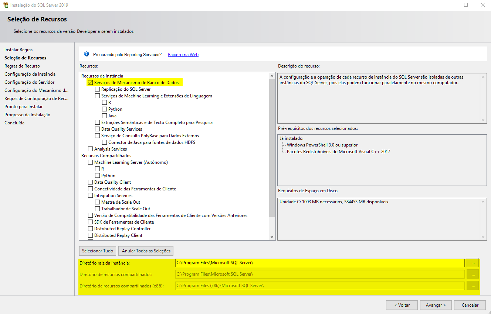

## Configuração SQL 2019

- Ao chegar na tela de **"Conf. de Instância"**, mantenha o valor informado e novamente em **"Avançar"**

**Obs: Preferível manter o mesmo nome padrão da configuração do banco para evitar problemas relacionados a conexões**

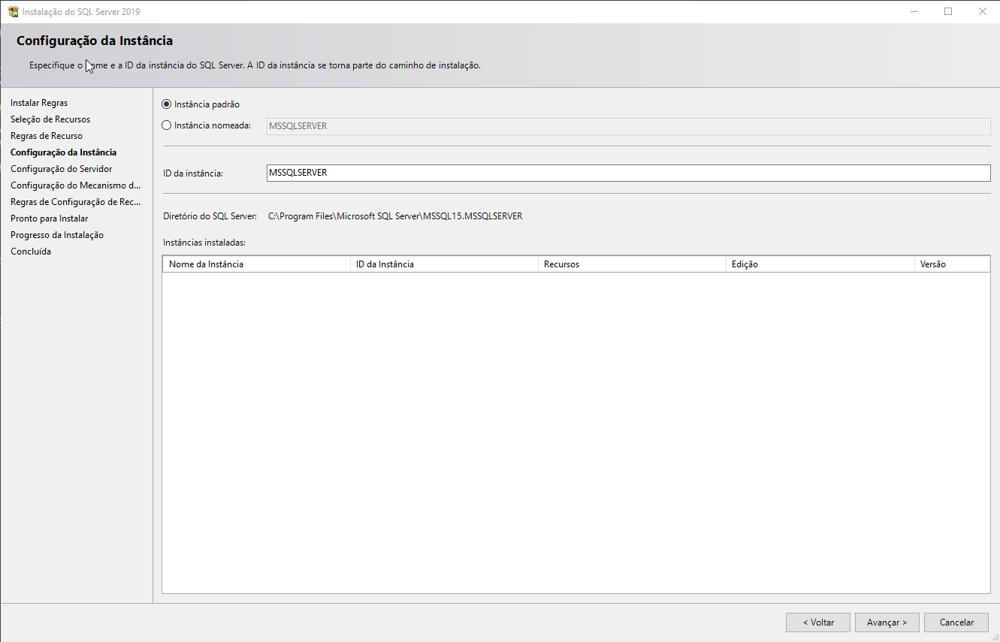

---

- Ao chegar na tela de **"Conf. de Instância"**, mantenha o valor informado e novamente em **"Avançar"**

**Obs: Nessa etapa serão confirmados os serviços criados e as contas de usuários que serão usadas para iniciar o serviço, também serão mantidas como padrão**

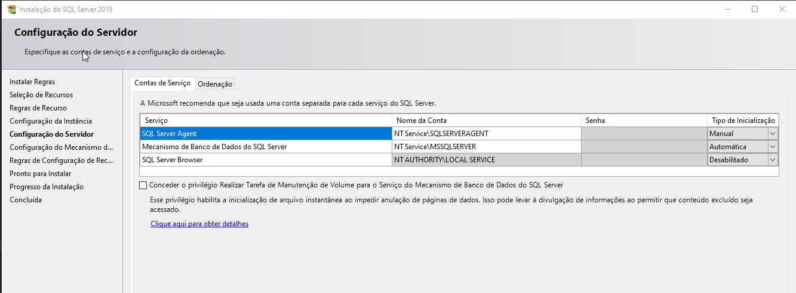

---

- Será alterado a ordenação na aba de **"Ordenação"**, alterando o valor de **"Latin1_General_CI_AS"** para **"Latin1_General_BIN"**

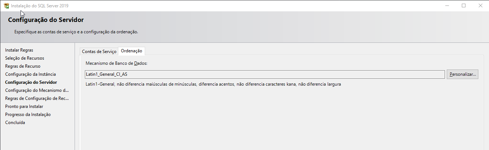

- Aonde ao abrir a tela clique sobre a opção **"Binário"**, depois em **"OK"** e novamente em **"Avançar"**

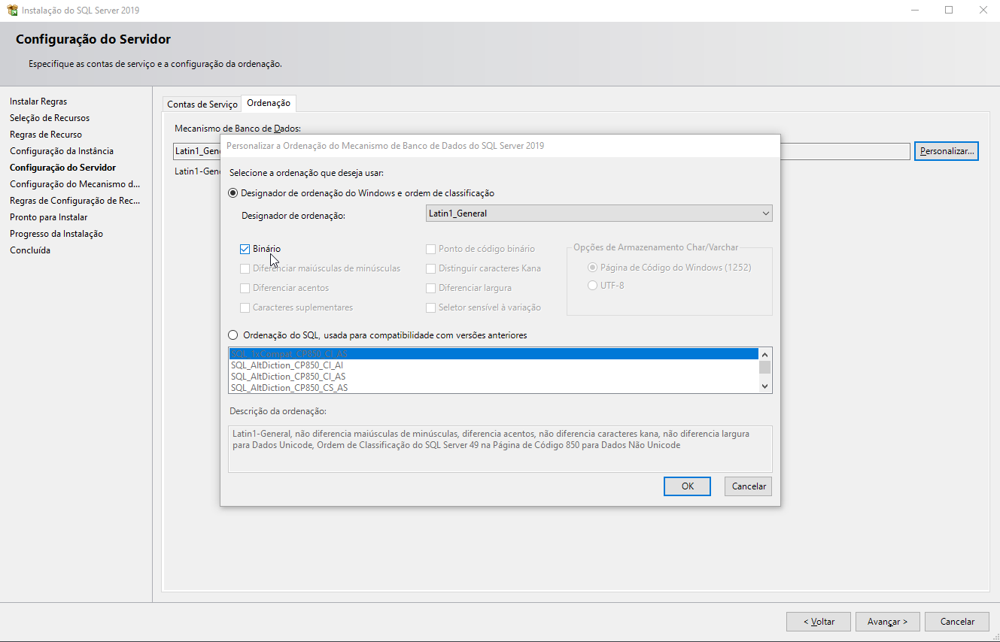

## Configuração do Mecanismo de Banco de Dados

- Ao chegar na tela de **"Conf. de Instância"**, mantenha o valor informado e novamente em **"Avançar"**

**Obs: Nesse caso será usado o **"Modo Misto"**, que será criado um usuário "sa" para seu uso**

- Credenciais de acesso:
  - **Usuário:** "sa"
  - **Senha:** "@00"

**Obs: Após a configuração será necessário clicar sobre a opção "Adicionar usuário atual" para que o usuário que está executando a instalação possa executar os comandos além do adminstrador**

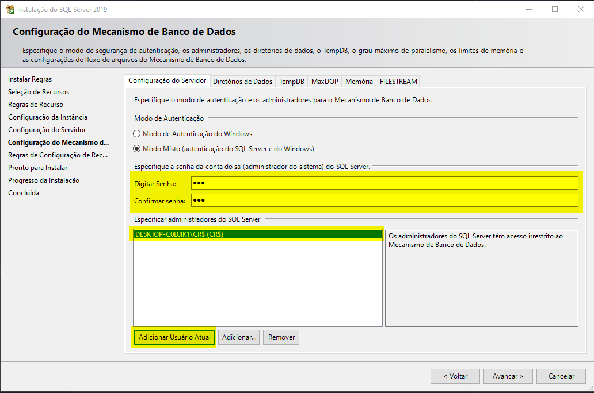

- Na aba **"Diretório de dados"**, serão mantidos os valores padrão na instalação.

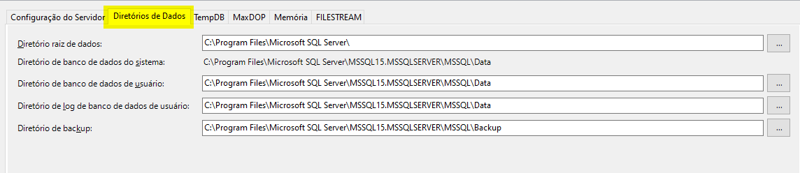

- Ao pressionar o botão **"Avançar"**, será exibido um resumo sobre a instalação.

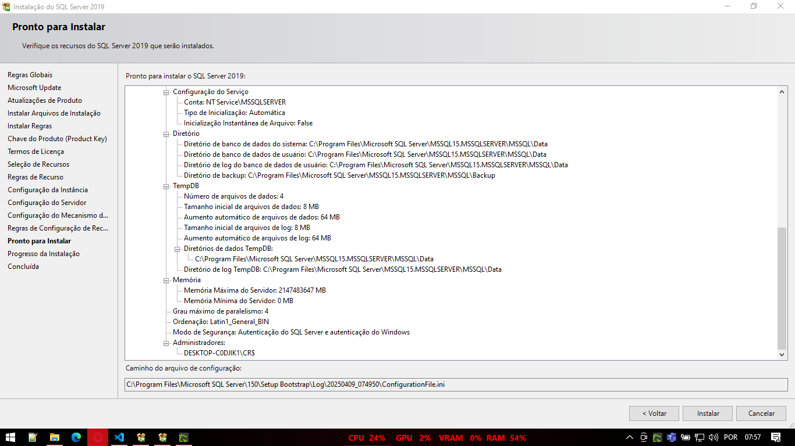

---

# Referência

- **Download SQL 2019**

O arquivo pode ser baixado pelo site [SQL 2019](https://drive.google.com/file/d/1Hp6zfKcvmjSEF3URIuVhWmBq69A2P294/view?usp=sharing).

---

    Desenvolvido e documentado por: Cristian Gustavo
    Data início: 12/04/2024
