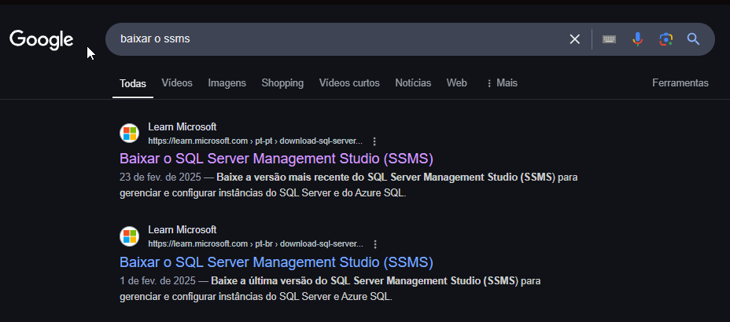
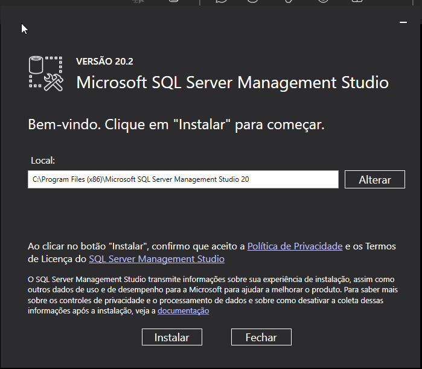
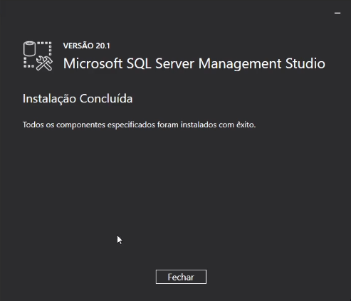
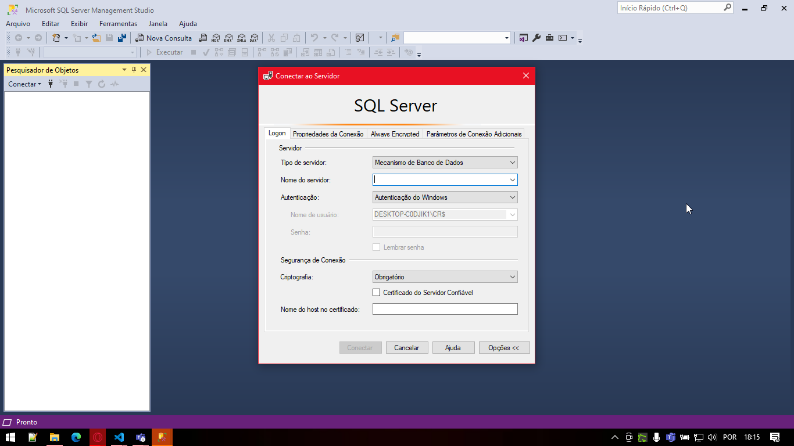

# Protheus-adm

## Instalação SSMS

---

Execução padrão do instalador:

Conclusão instalador:

Conclusão instalador:

---

# Referência
  - **Download SSMS**
   
   O arquivo pode ser baixado pelo site [SSMS](https://aka.ms/ssmsfullsetup).

  - **Download SSMS**
   
   O arquivo pode ser baixado pelo site [SSMS](https://aka.ms/ssmsfullsetup).

---

    Desenvolvido e documentado por: Cristian Gustavo
    Data início: 12/04/2024