# Protheus-adm

## Criação de Banco de Dados / Usuário / Conexão Protheus

Com o SSMS aberto, clique sobre a aba **"Banco de dados"** e em seguida sobre a opção **"Banco de dados"**:
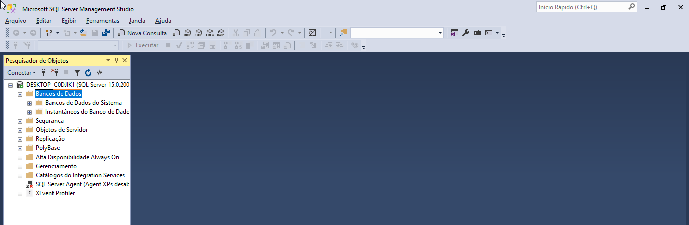

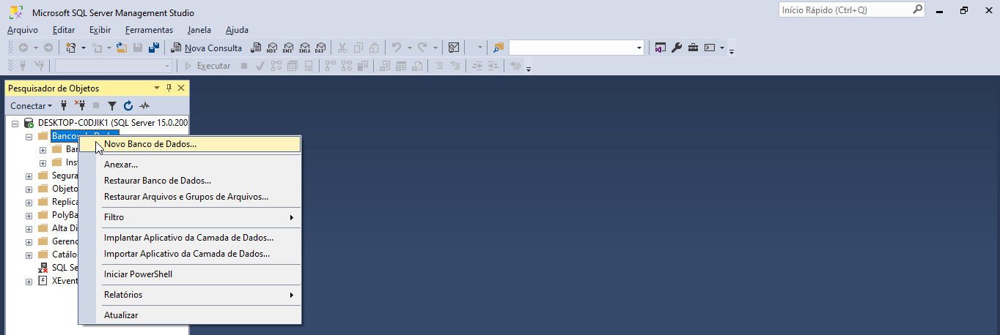

O nome do banco foi selecionado como **"P1212210"**, em seguida confirme sobre a ordenação do banco de dados na opção **"Opções"**:
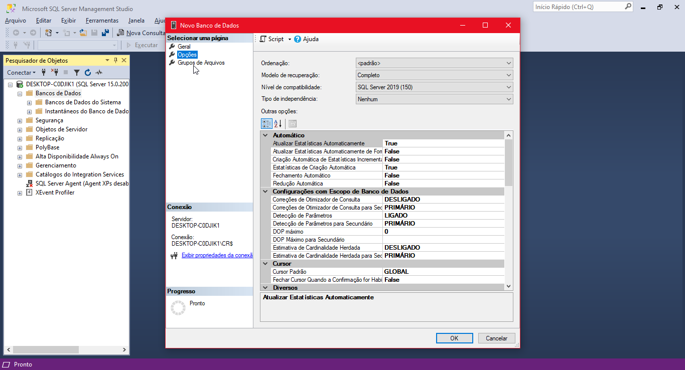

**OBS: Ao abrir a aba, é possível visualisar a ordenação preenchida como "Padrão", sendo referente ao valor informado em sua instalação. Caso seja necessário reinformar o valor, basta selecionar a opção "Latin_1_General" e confirmar sobre a opção "OK"**
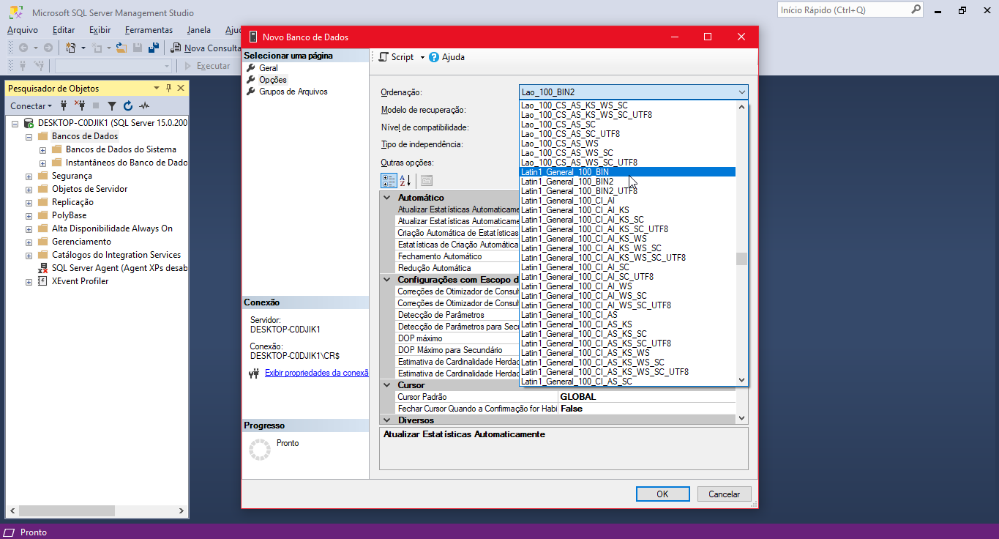
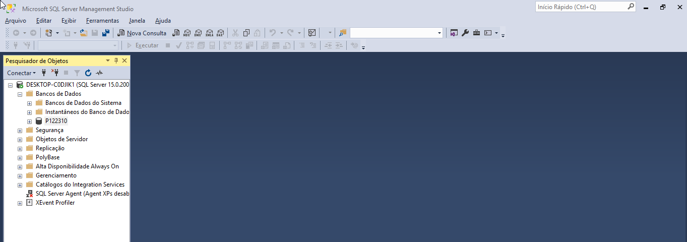

## Criação de Usuário Conexão Protheus

Uma boa prática é a criação de um usuário para acessar o banco de dados, para que não seja necessário utilizar o usuário administrador para isso.

Com o SSMS aberto, clique sobre a aba **"Segurança"** e em seguida sobre a opção **"Logons"**:
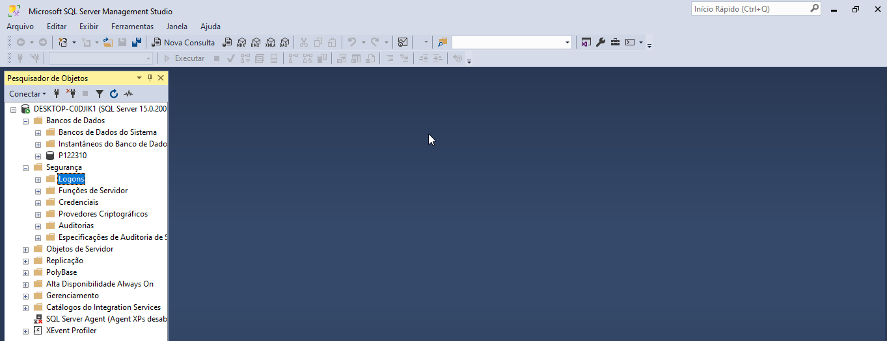
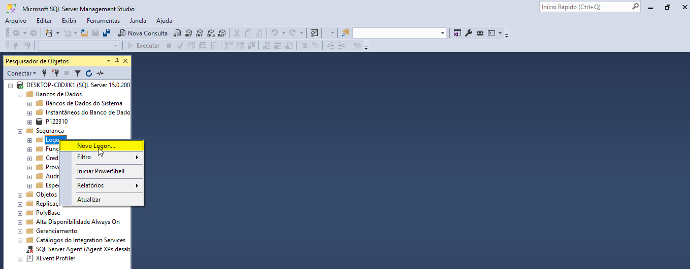

Ao abrir a tela será informado o nome do logon e a senha com as seguintes credenciais:

- Credenciais de acesso:
  - **Nome de logon:** "adminP12"
  - **Senha:** "@01"
  - **Remover a opção "Impor política de senha**

Feito isso, clique sobre a aba **"Funções do servidor"** e em seguida verifique se somente a opção **"public"** está selecionada.

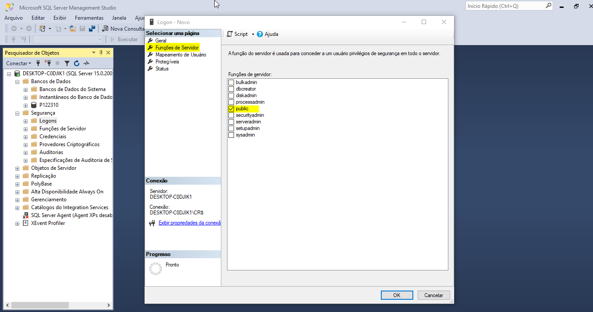

Feito isso, selecione qual banco o usuário terá acesso, como no caso o banco **"P1212210"** e selecione a opção **"db_owner"** para que o usuário tenha acesso como proprietário do banco de dados, feito isso aperte sobre a opção **"OK"**, confirmando a operação.

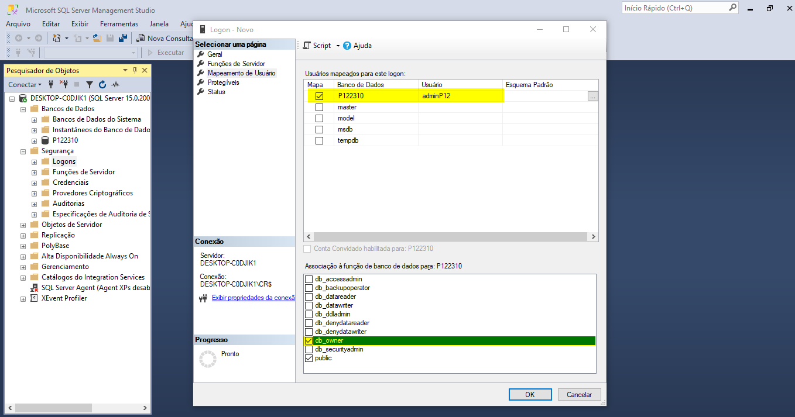
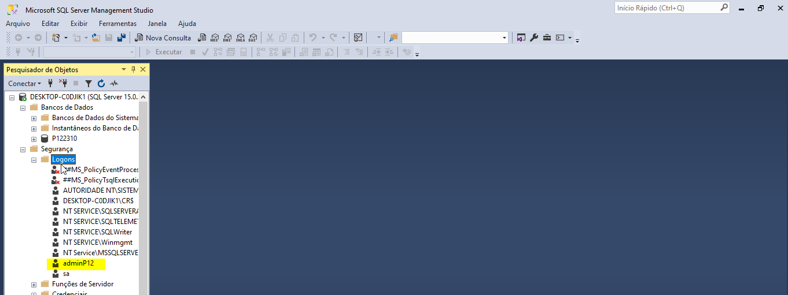

## Criação conexão ODBC

Para criar a conexão ODBC é necessário pesquisa no Iniciar do computador e clicar sobre a opção **"ODBC 64 bits"**, sobre a opção **"DNS de Sistema"** e em **"Adicionar"**.

**Obs: Sendo necessário apertar sobre a opção dos bits da sua máquina, sendo 32bits ou 64bits, como é o caso.**

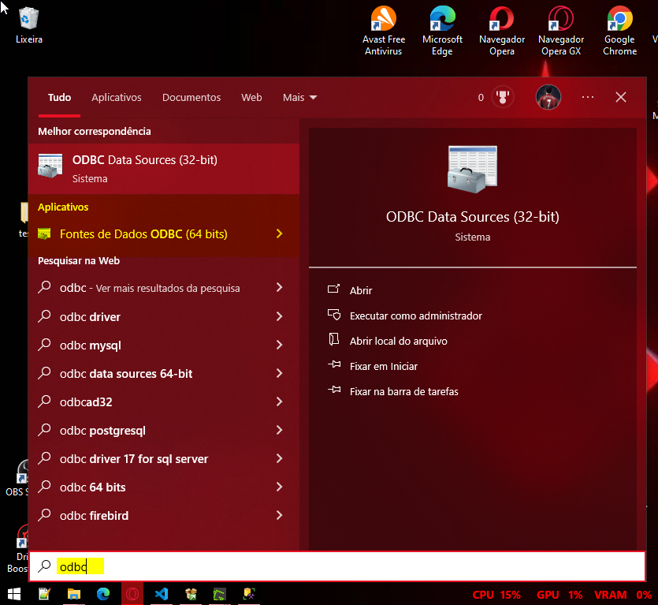
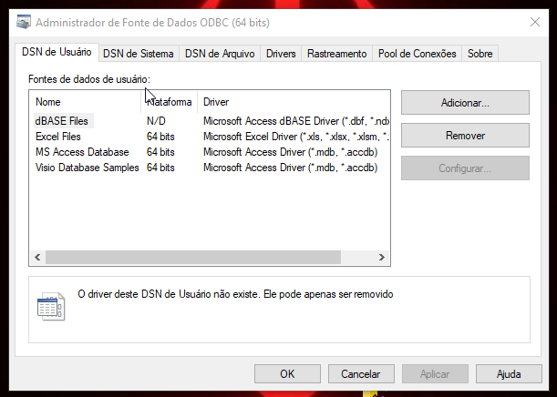
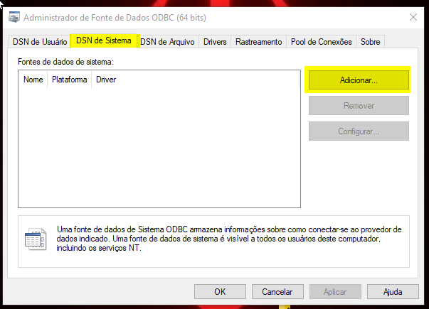

Feito isso selecione a opção **"SQL Server Native Cliente 11.0"** e confirme em seguida.

**Obs: Para o funcionamento da conexão do Protheus com o banco de dados é necessário utilizar essa opção.**

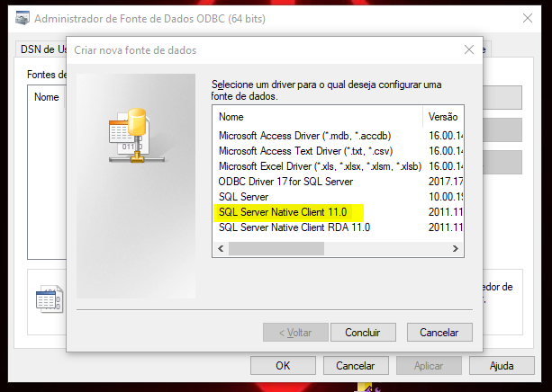

Com a abertura da nova tela, informe o nome do banco de dados a ser conectado e qual SQL Server será conectado, sendo:

- Credenciais de acesso:
  - **Nome:** "P1212210"
  - **SQL Server:** "P1212210", poderia ser informado como **"."** por se tratar de um localhost

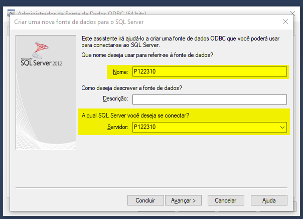

**Obs: Em caso de problemas relacionados a conexão pode ser usado o "localhost no campo "SQL Server""**

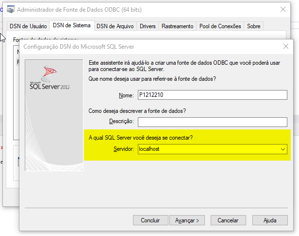

Desta forma tendo acesso a lista de banco de dados, criados anteriormente no SQL Server.

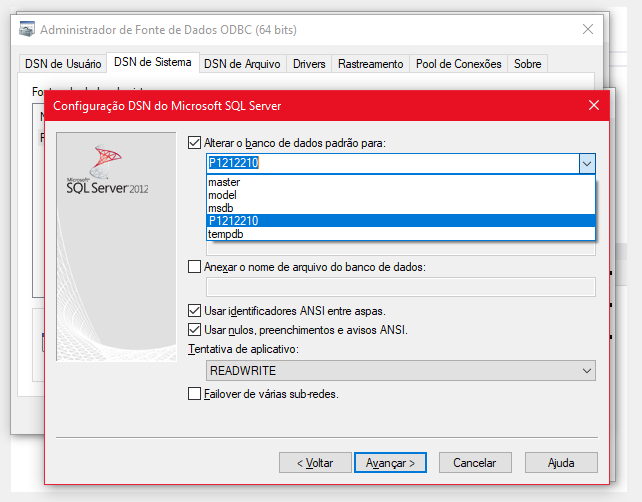

- Credenciais de logon:
  - **ID Logon:** "adminP12"
  - **SQL Server:** "@01"

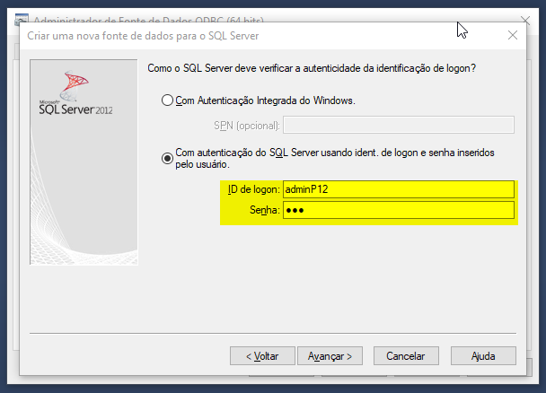

Feito isso informe o banco de dados padrão para a conexão, sendo **"P1212210"** e confirme em seguida.

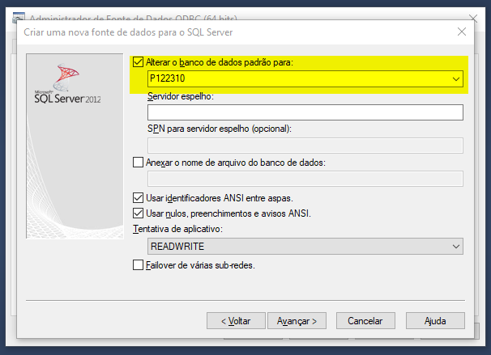
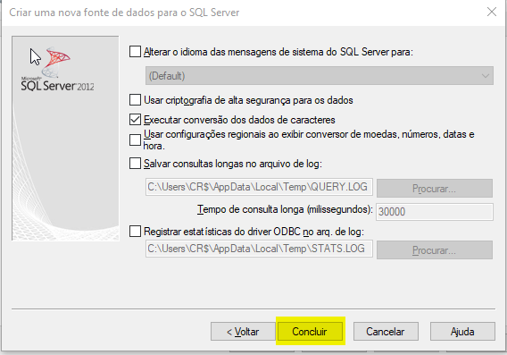
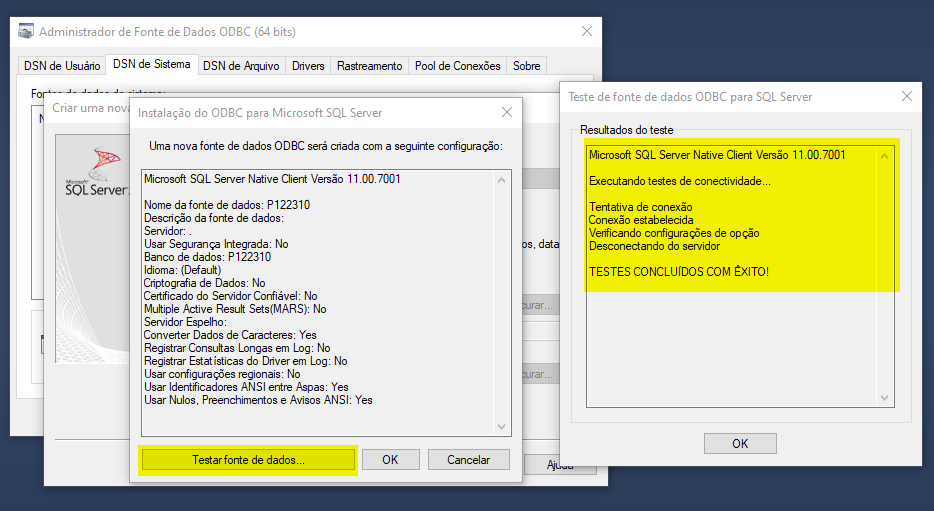

---

    Desenvolvido e documentado por: Cristian Gustavo
    Data início: 12/04/2024
