# Protheus-adm

## TOTVSLicense

Execução padrão do instalador:

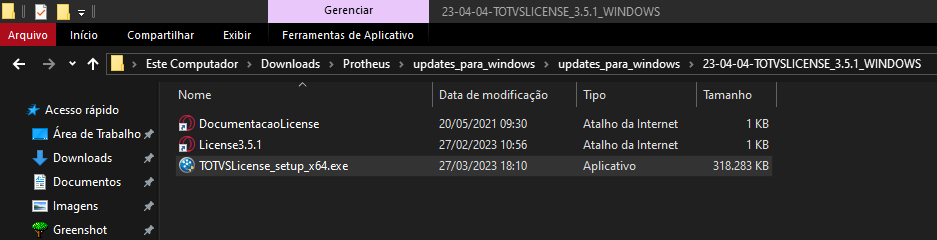

Primeira execução:

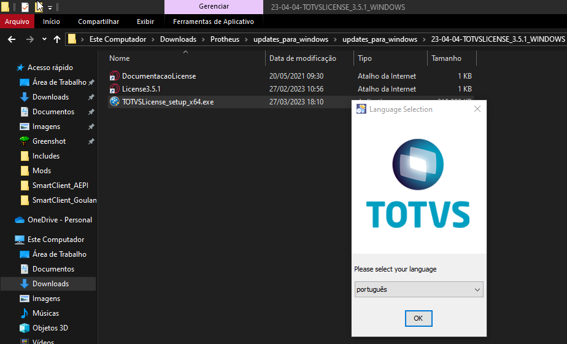

Abertura aba "Instalação", apertando sobre a opção **"Avançar"**:

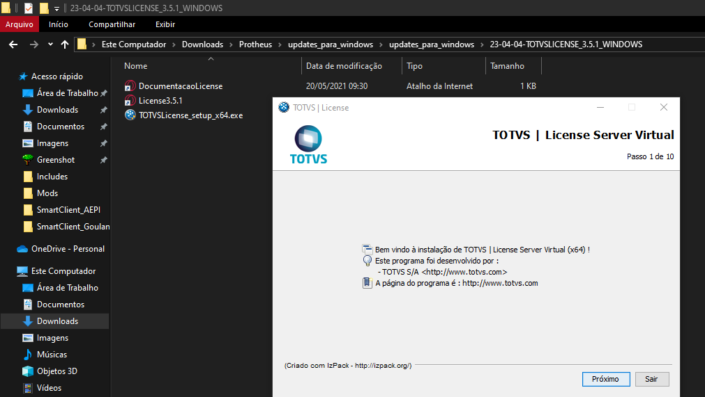

Diretório instalação, confirmação criação diretório:

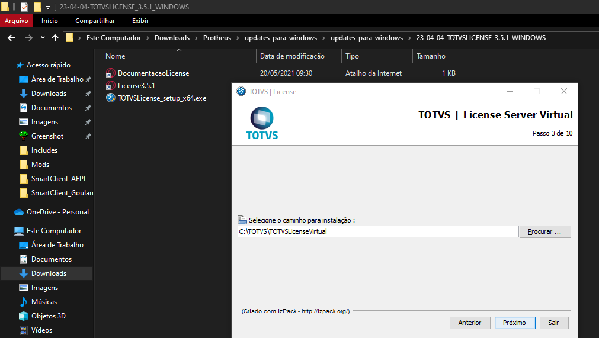

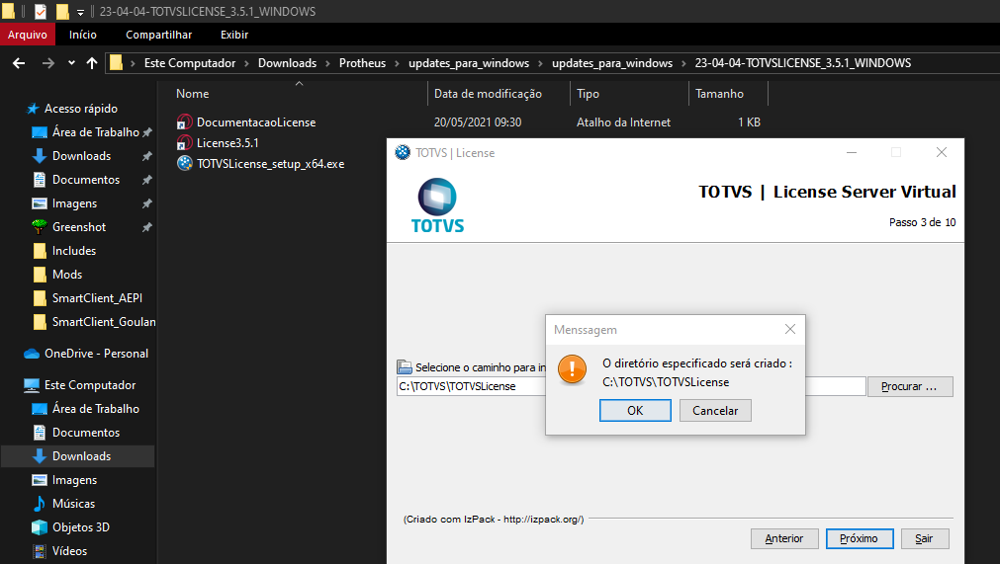

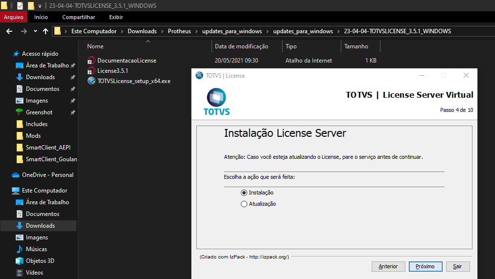

Resumo com os pacotes que serão instalados:

- Clicar sobre **"Avançar"**

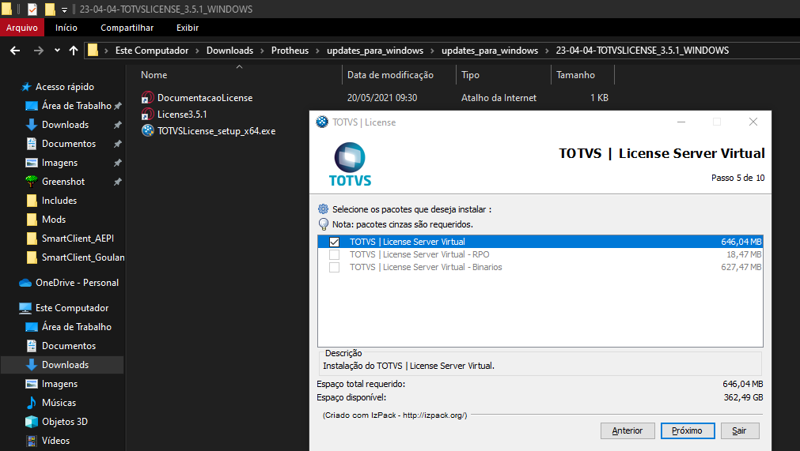

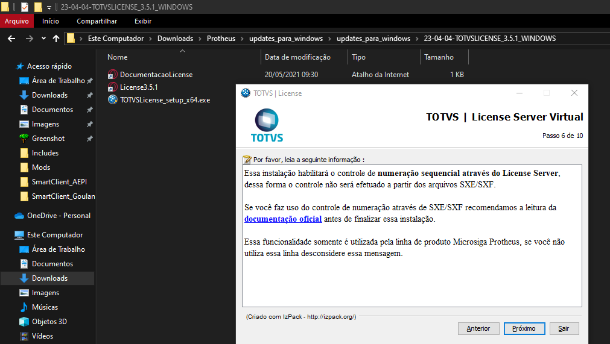

## Configuração Portas e Serviços

Ao prosseguir com a instalação, será exibida a seguinte tela com as informações referentes aos nomes e portas dos serviços Protheus.

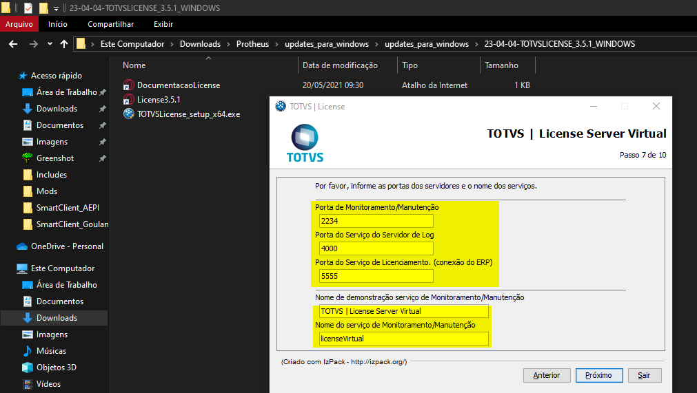

- Portas Serviços:
  - **Porta de Monitoramento/ Manutenção:**
    Porta de comunicação, será usada para monitorar licenças.
  - **Porta de Serviço do Servidor do Log:**
    Porta de serviço de log.
  - **Porta de Serviço de Licenciamento:**
    Porta de serviço de licenciamento, **será informada no ERP posteriormente.**
- Nome do serviço de Monitoramento/ Manutenção:
  - **Nome de demonstração serviço de Monitoramento/ Manutenção:**
    Nome de exibição do serviço TOTVS License.
  - **Nome do serviço de Monitoramento/ Manutenção:**

Após alterações o preenchimento final se encontra dessa forma, clique sobre a opção **"Avançar"**:

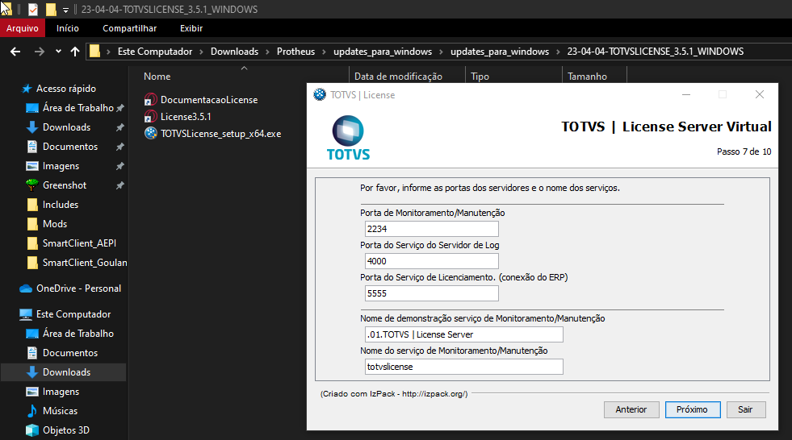

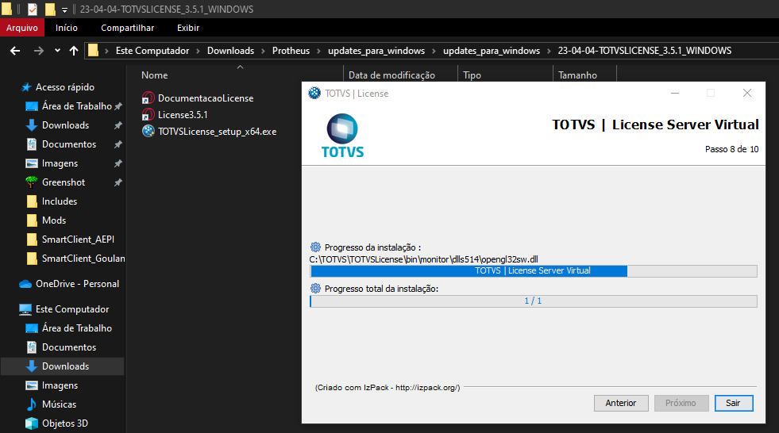

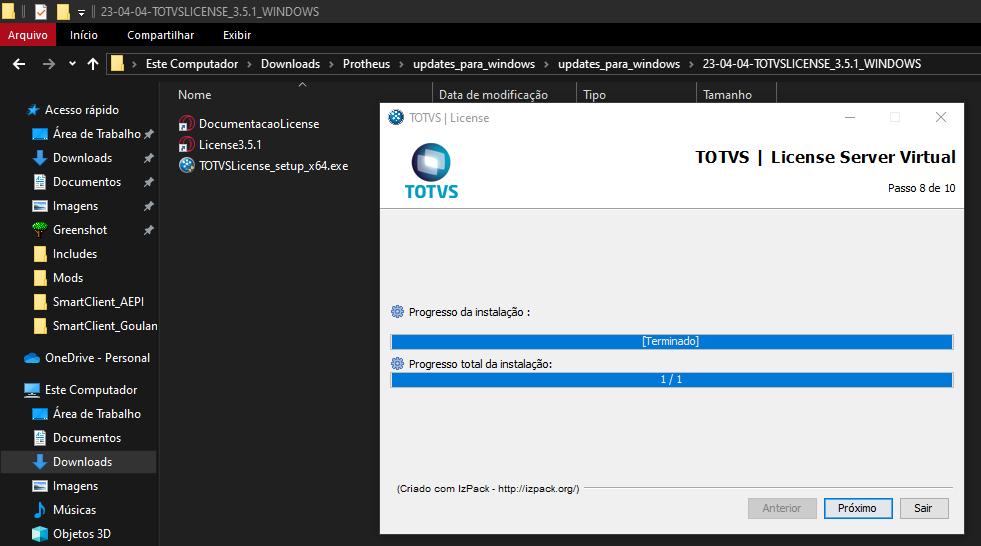

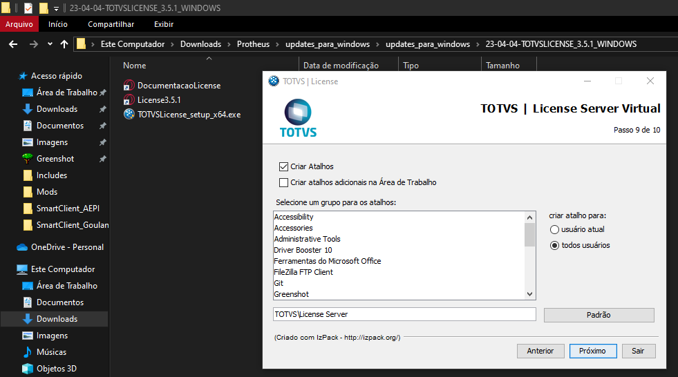

Nesse momento é exibido a tela de execução de um processo caso a instalação fosse feita no ambiente do cliente, informando seu Totvs ID, sendo obtido no Portal do Cliente.

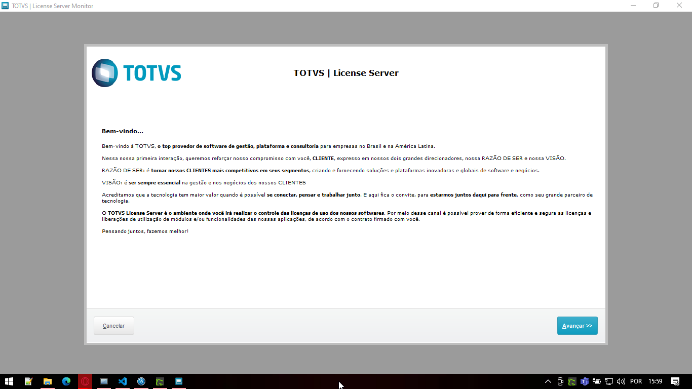

Basta clicar sobre a opção **"Avançar"**

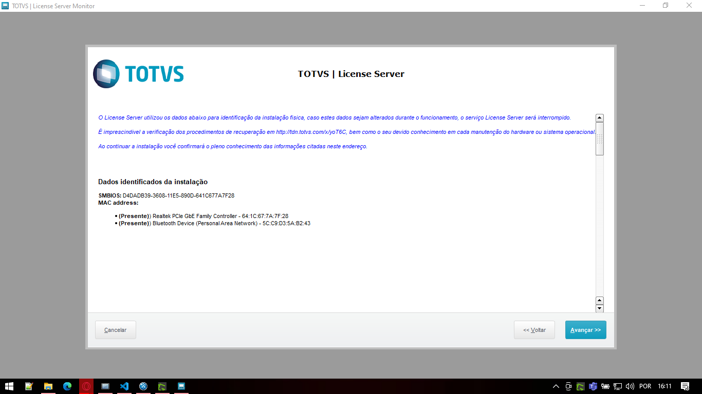

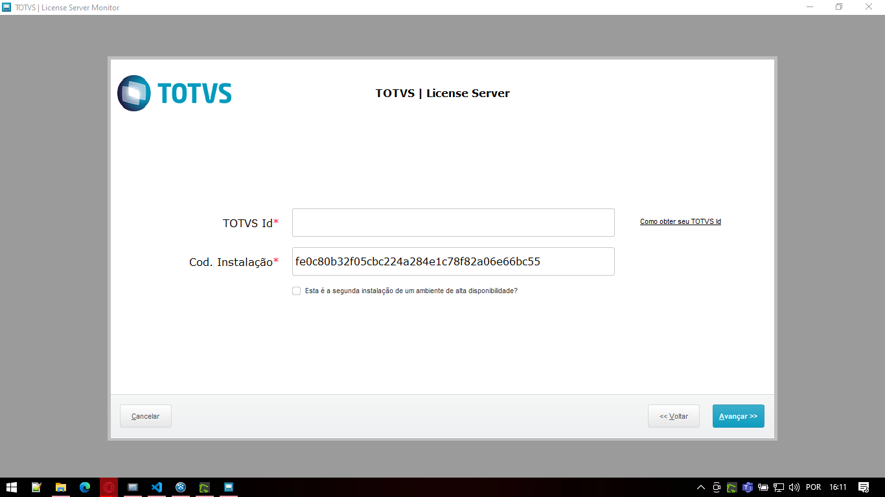

**Obs: Nesse caso será instalado somente para testes e desenvolvimento, podendo apertar sobre a opção "Cancelar"**

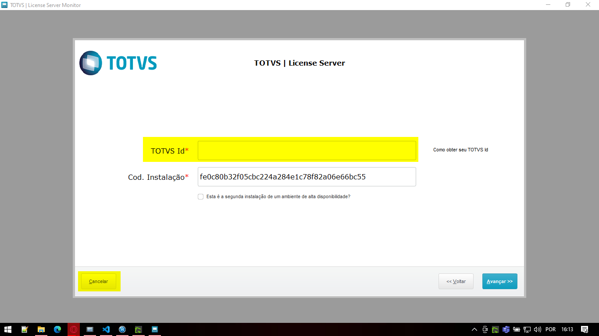

Após a finalização do processo, é possível visualizar o serviço criado na lista de serviços do Windows.

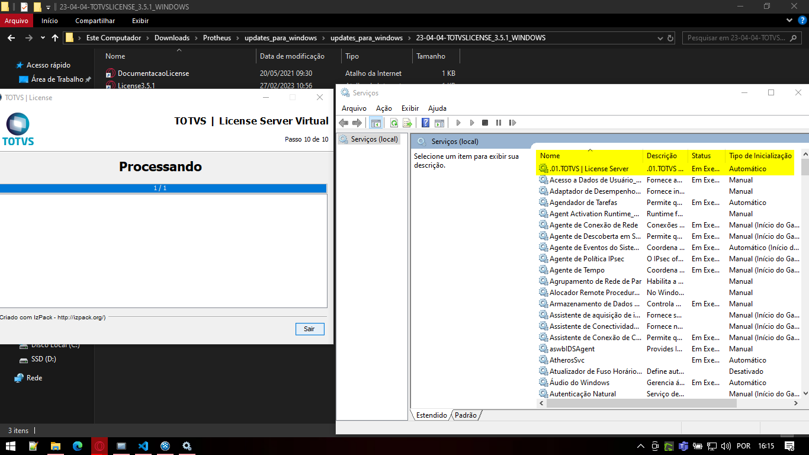

---

# Referência

- **Download TOTVS License Windows**

O arquivo pode ser baixado pelo site [TOTVS License](https://drive.google.com/file/d/1nR_ueegSh1lzCeiVSmcjQxxO96ePn7X5/view?usp=drive_link)

- **Download TOTVS instalador Windows**

O arquivo pode ser baixado pelo site [TOTVS instalador Windows](https://drive.google.com/file/d/1DATPRFPiTrb0u5rHqUh5UgSIQWaXDxV9/view?usp=drive_link)

- **Download pacote com atualizações**
  O arquivo pode ser baixado pelo site [pacote com atualizações](https://drive.google.com/file/d/160os2AURcOAodaER7n3dQTUEgjDHPWK9/view?usp=drive_link)

---

    Desenvolvido e documentado por: Cristian Gustavo
    Data início: 12/04/2024
