# Protheus-adm

## Instalação Protheus

Execução padrão do instalador como admnistrador, selecionar o idioma, confirmar e aceitar os termos de licença:

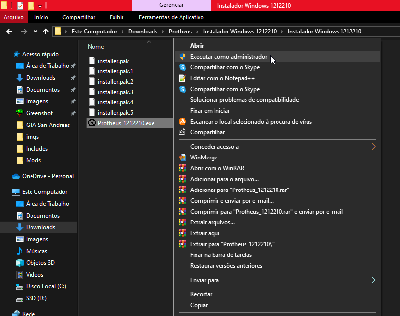

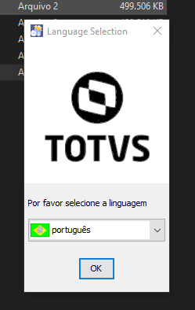

Ao solicitar o diretório de instalação será alterado o valor padrão de **"C:\TOTVS12\Protheus"** para o diretório **"C:\TOTVS\Protheus\P122210"** para que seja instalado na mesma pasta que o Totvs License.

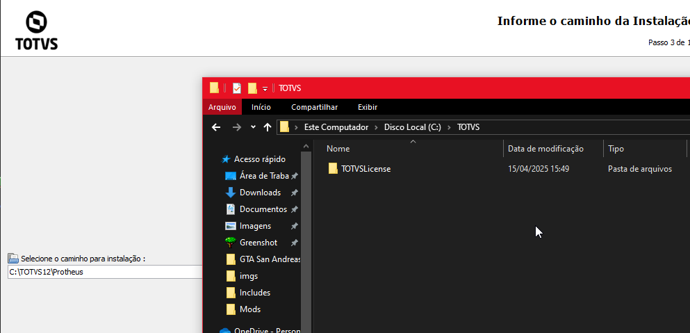

Ao selecionar o idioma de instalação, confirme os produtos que serão instalados, mantendo o padrão, necessário somente clicar em **"Próximo"**.

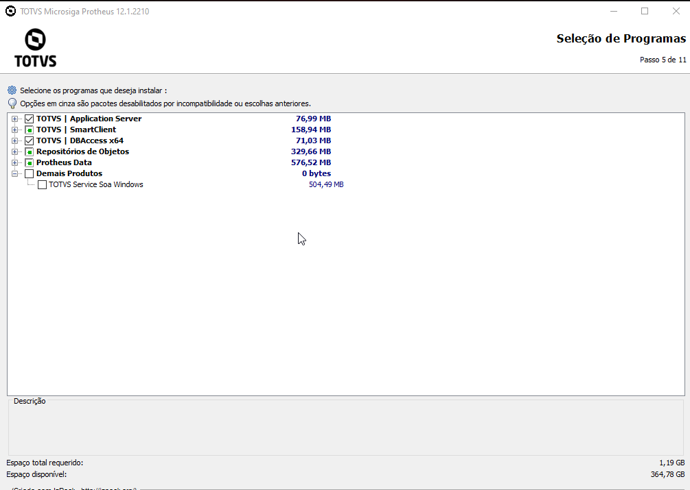

## Configuração Portas e Serviços

Ao prosseguir com a instalação, será exibida a seguinte tela com as informações referentes aos nomes e portas dos serviços Protheus.

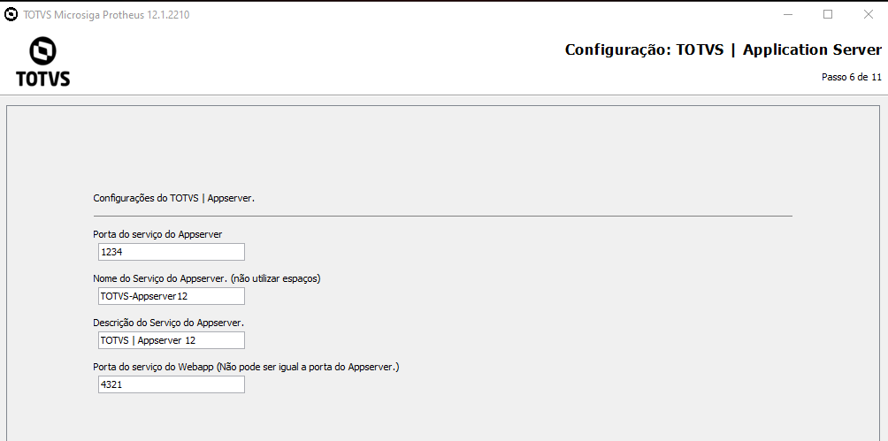

- Portas Serviços:
  - **Porta de serviço do AppServer:**
    Mantido o valor padrão como **"1234"**
  - **Nome do Serviço do AppServer:**
    Alterado para **"totvsappserver122210"**
  - **Descrição do Serviço do AppServer:**
    Alterado para **".03.TotvsAppServer | 1212210"**, desta forma ficará abaixo do TotvsLicense no Serviçõs do Windows.
    Nome de exibição do serviço TOTVS License, **não pode ser igual a porta do AppServer.**
    Mantido o valor padrão como **"4321"**

Após alterações o preenchimento final se encontra dessa forma, clique sobre a opção **"Avançar"**:

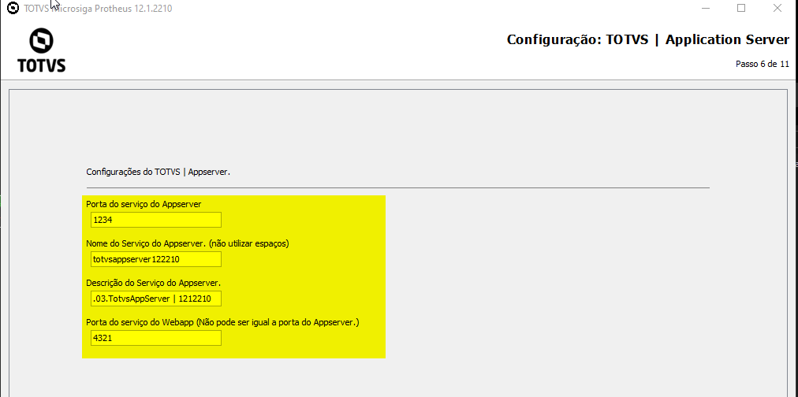

Nesse momento é exibido com as configurações do License Server, tendo vazio como seu valor padrão.

- Configurações do License Server:
  - **DNS License Server:**
    Informado como **"localhost"**, por se tratar de uma instalação local.
  - **Porta:**
    Alterado para **"5555"**

**Obs: Caso a instalação fosse feita no ambiente de servidor e o TOTVS License se encontrasse no mesmo ambiente do servidor, poderia ser utilizado o "localhost", caso contrário poderia ser informado o nome ou endereço IP do servidor.**    

Após alterações o preenchimento final se encontra dessa forma, clique sobre a opção **"Avançar"**, exibindo o andamento da instalação:

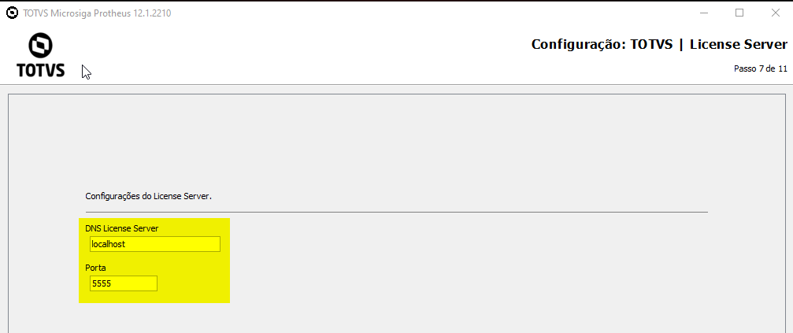

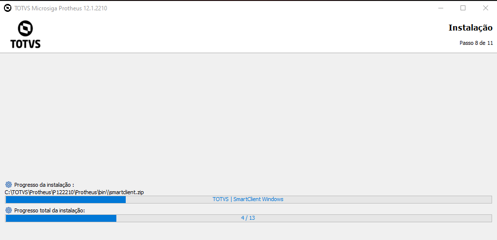

Após finalizar o processo de instalação, será questionado sobre a criação de atalhos, os valores padrão serão mantidos, sendo necessário apertar somente sobre a opção **"Avançar"**:

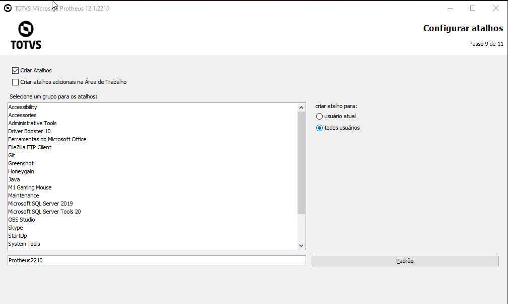
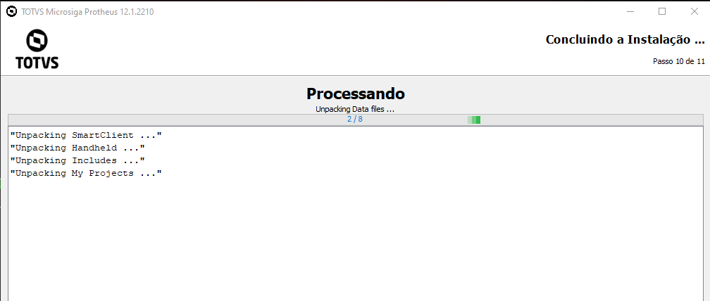

Após a instalação, será exibido uma tela sobre a configuração com o banco de dados, como a instalação será feita em sequência, é necessário apertar somente sobre a opção **"Fechar"**:

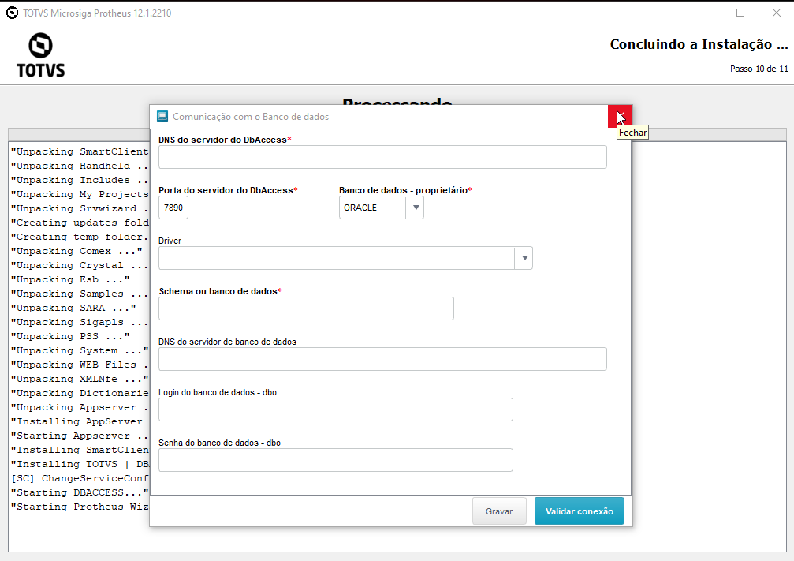

Finalizando sua instalação é possível visualizar o serviço como **".03.TotvsAppServer | 1212210"**.

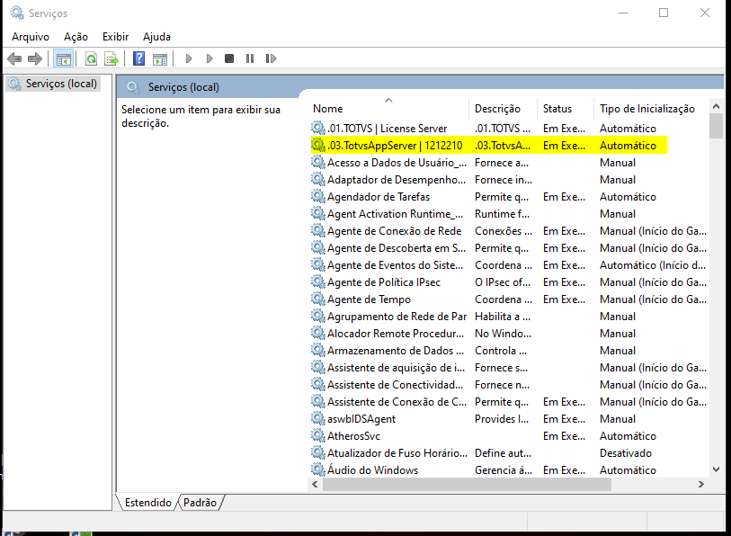
---

# Referência

- **Download TOTVS License Windows**

O arquivo pode ser baixado pelo site [TOTVS License](https://drive.google.com/file/d/1nR_ueegSh1lzCeiVSmcjQxxO96ePn7X5/view?usp=drive_link)

- **Download TOTVS instalador Windows**

O arquivo pode ser baixado pelo site [TOTVS instalador Windows](https://drive.google.com/file/d/1DATPRFPiTrb0u5rHqUh5UgSIQWaXDxV9/view?usp=drive_link)

- **Download pacote com atualizações**
  O arquivo pode ser baixado pelo site [pacote com atualizações](https://drive.google.com/file/d/160os2AURcOAodaER7n3dQTUEgjDHPWK9/view?usp=drive_link)

---

    Desenvolvido e documentado por: Cristian Gustavo
    Data início: 12/04/2024
