# Protheus-adm

## Configuração DBACCESS

A instalação, configuração do DBAccess é possível ser feita via instalador via download ou diretamente pela pasta instalada com o Protheus.

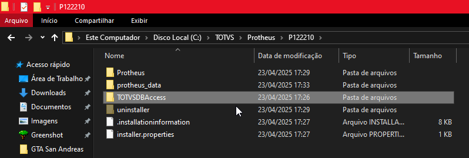
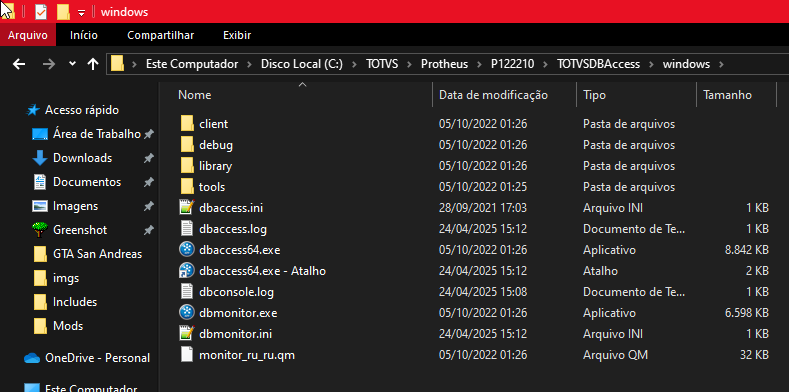

---

Caso tente conectar diretamente o DBAccess vai retornar uma mensagem de erro.

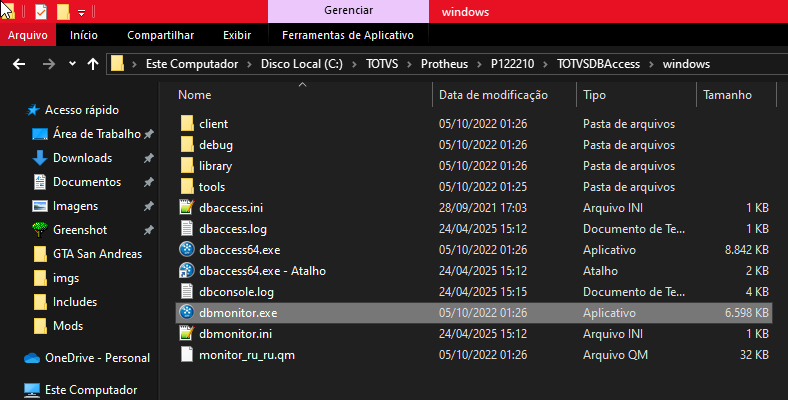

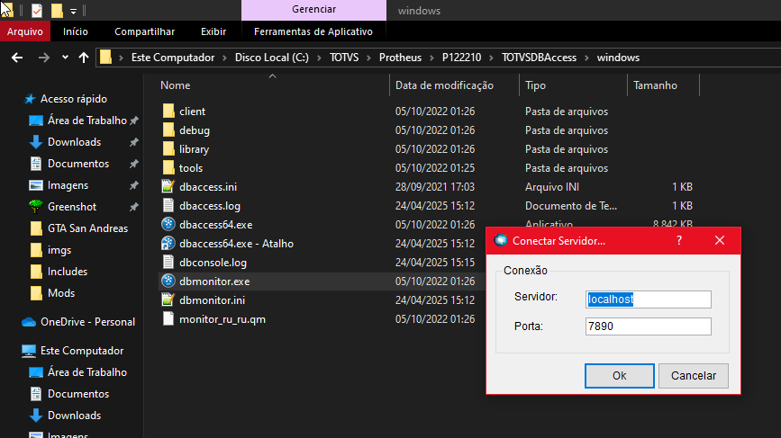

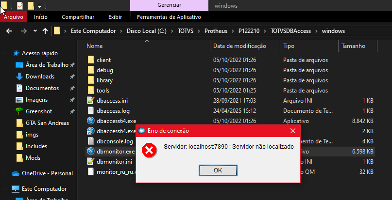

Como o serviço está sendo executado em base local, é necessário executar, criar o serviço de conexão. Necessário criar um atalho no mesmo diretório, ir em Propriedades do atalho.

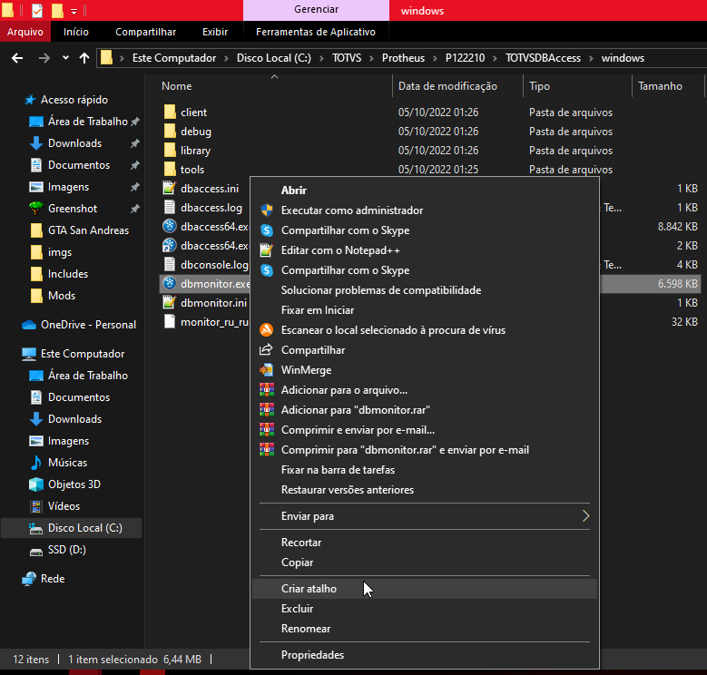

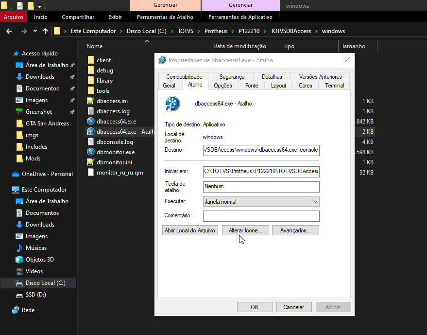

Ao prosseguir com a instalação, será exibida a seguinte tela com as informações referentes aos nomes e portas dos serviços Protheus.

---

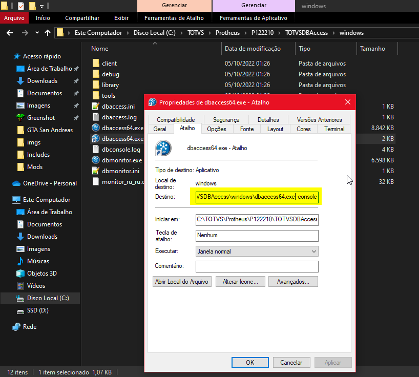

- Portas Serviços:
  - **Destino:**
    Adicionado somente um **" -console"**
    Desta forma:
    **"C:\TOTVS\Protheus\P122210\TOTVSDBAccess\windows\dbaccess64.exe -console"**

Após executar o atalho criado, o serviço estará ativo, sendo possível realizar a conexão do DBAcess.

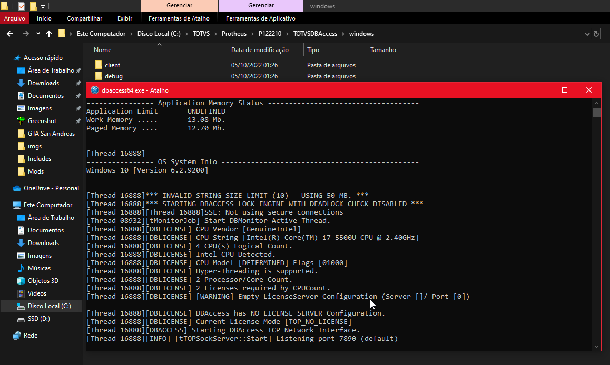

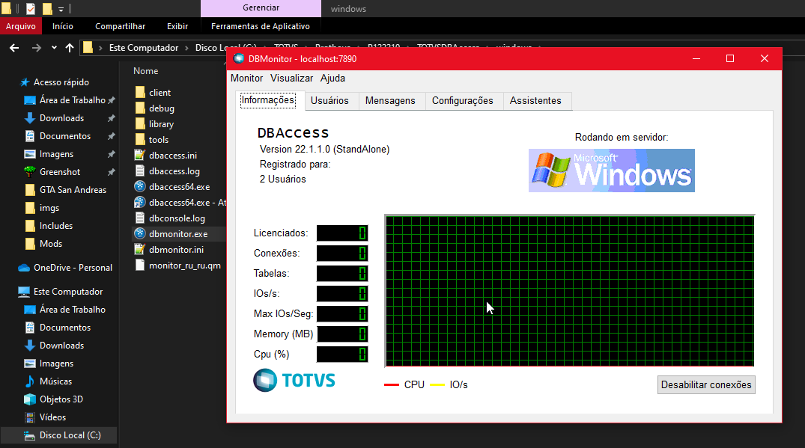

# dev

# Configuração acesso DBAcess

Para fazer a criação da conexão com o banco de dados, clique sobre a aba **"Configurações"**.

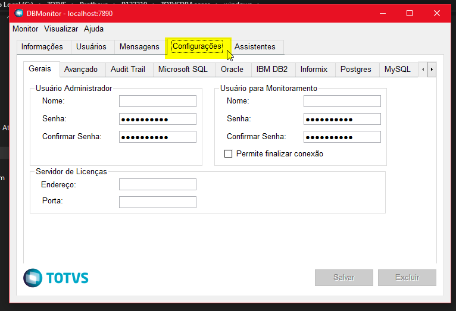

Em sequida sobre a opção **"Microsoft SQL"**.

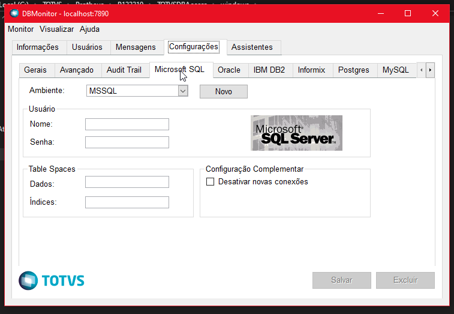

- Portas Serviços:
  - **Porta de serviço do AppServer:**
    Mantido o valor padrão como **"1234"**
  - **Nome do Serviço do AppServer:**
    Alterado para **"totvsappserver122210"**
  - **Descrição do Serviço do AppServer:**
    Alterado para **".03.TotvsAppServer | 1212210"**, desta forma ficará abaixo do TotvsLicense no Serviçõs do Windows.
    Nome de exibição do serviço TOTVS License, **não pode ser igual a porta do AppServer.**
    Mantido o valor padrão como **"4321"**

Após alterações o preenchimento final se encontra dessa forma, clique sobre a opção **"Avançar"**, opção **"Novo"**.

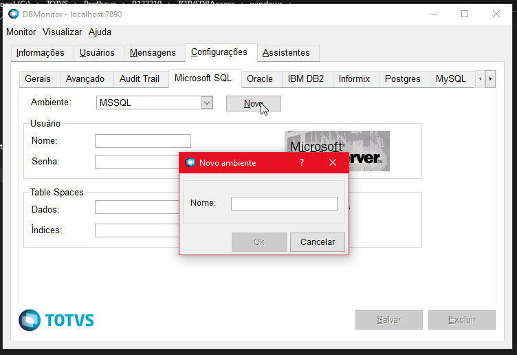
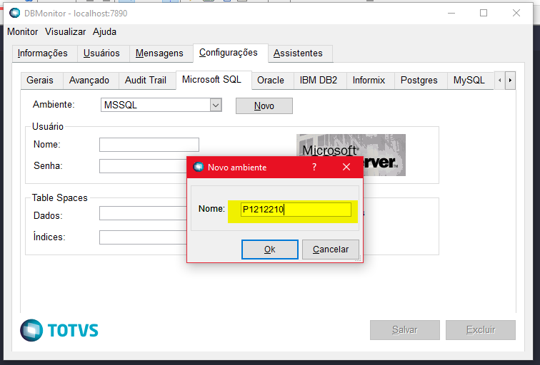

Nesse momento será usado o logon criado via SQLServer.

- Configurações do License Server:
  - **Nome:**
    Informado como **"adminP12"**, por se tratar de uma instalação local.
  - **Senha:**
    Alterado para **"@01"**

Sendo preenchido desta forma, basta apertar sobre o botão de **"Salvar"**.

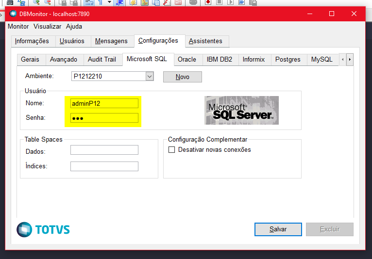

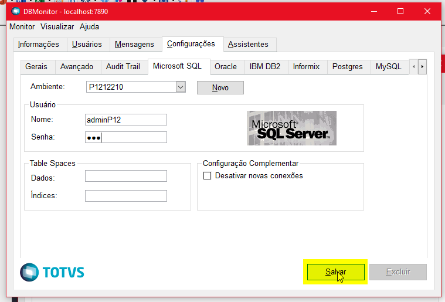

É possível testar a conexão clicando na aba de **"Assistentes"**, **"Validação de Conexão"**, **"Avançar"**, Selecione a opção **"Microsoft SQL"**, novamente **"Avançar"** e informar o nome do banco de dados, sendo: **"P1212210"**.

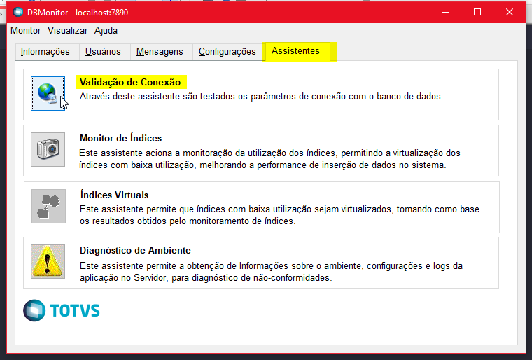
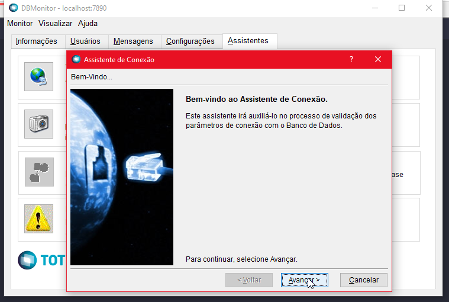
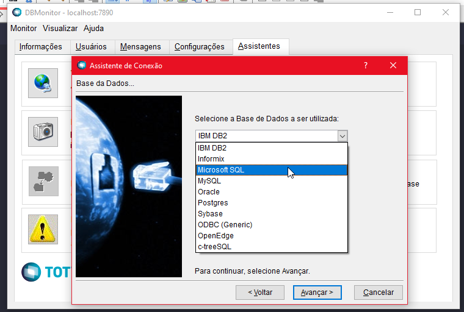
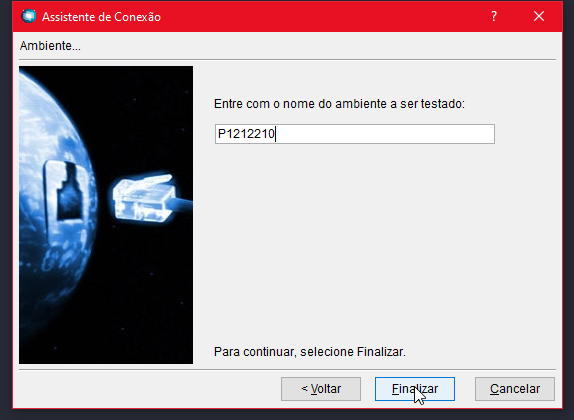
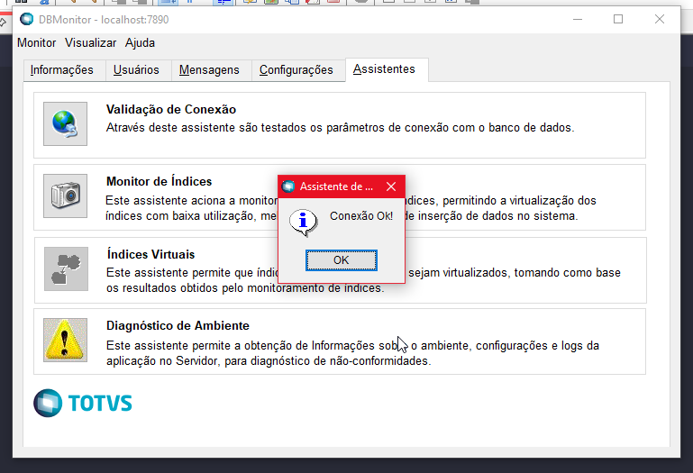

# Referência

- **Download TOTVS License Windows**

O arquivo pode ser baixado pelo site [TOTVS License](https://drive.google.com/file/d/1nR_ueegSh1lzCeiVSmcjQxxO96ePn7X5/view?usp=drive_link)

- **Download TOTVS instalador Windows**

O arquivo pode ser baixado pelo site [TOTVS instalador Windows](https://drive.google.com/file/d/1DATPRFPiTrb0u5rHqUh5UgSIQWaXDxV9/view?usp=drive_link)

- **Download pacote com atualizações**
  O arquivo pode ser baixado pelo site [pacote com atualizações](https://drive.google.com/file/d/160os2AURcOAodaER7n3dQTUEgjDHPWK9/view?usp=drive_link)

- **Download pacote com atualizações**
  Documentação configuração [Como Instalar e Configurar o Protheus 12.1.23 – Lobo Guará – Parte 2](https://protheusadvpl.com.br/como-instalar-e-configurar-o-protheus-12-1-23-lobo-guara-parte-2/)

---

    Desenvolvido e documentado por: Cristian Gustavo
    Data início: 12/04/2024
