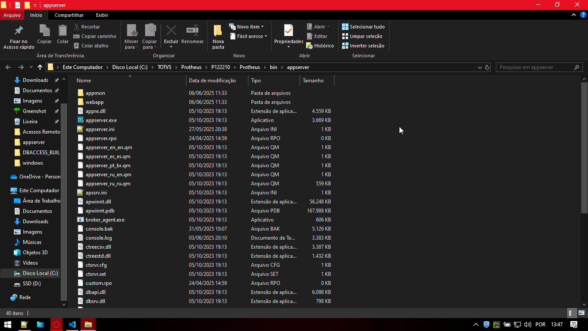
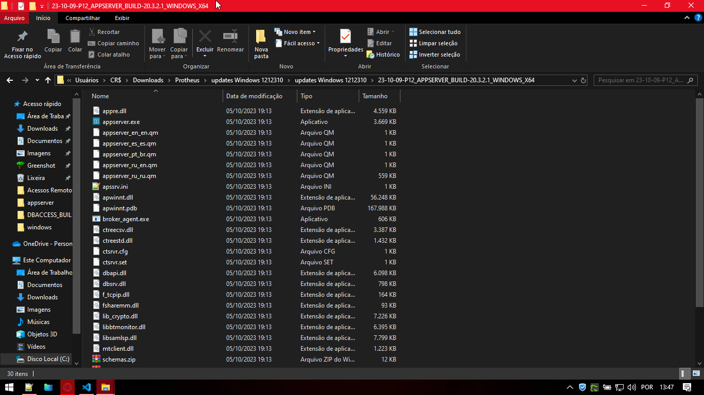
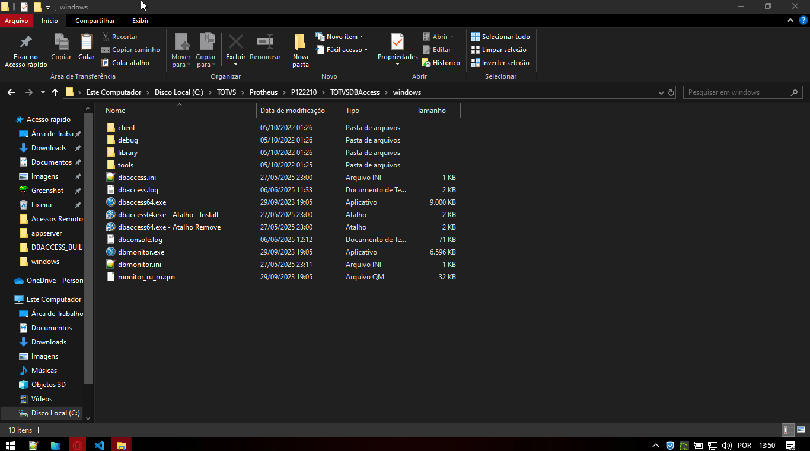
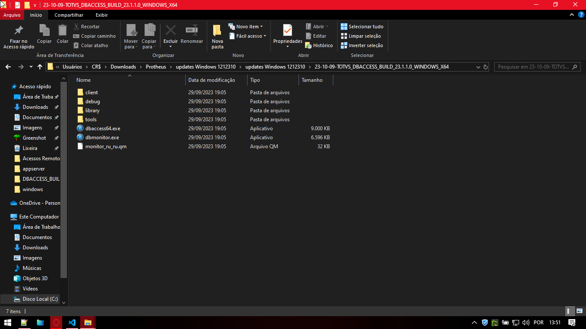
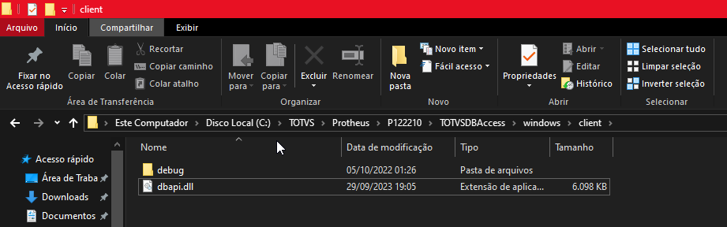
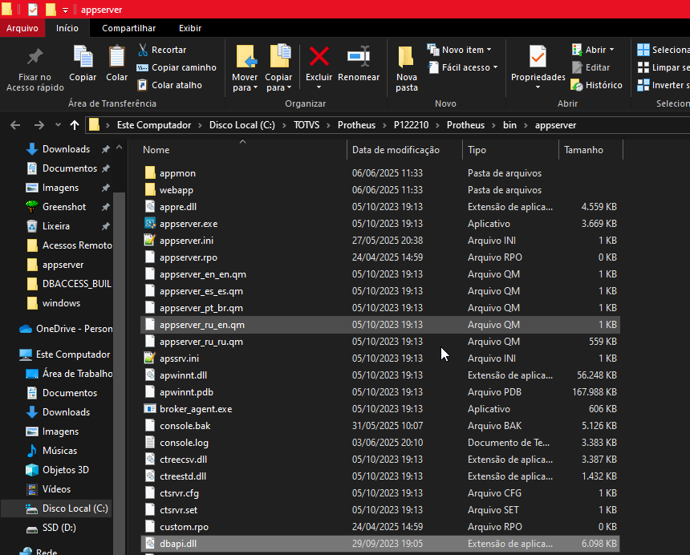
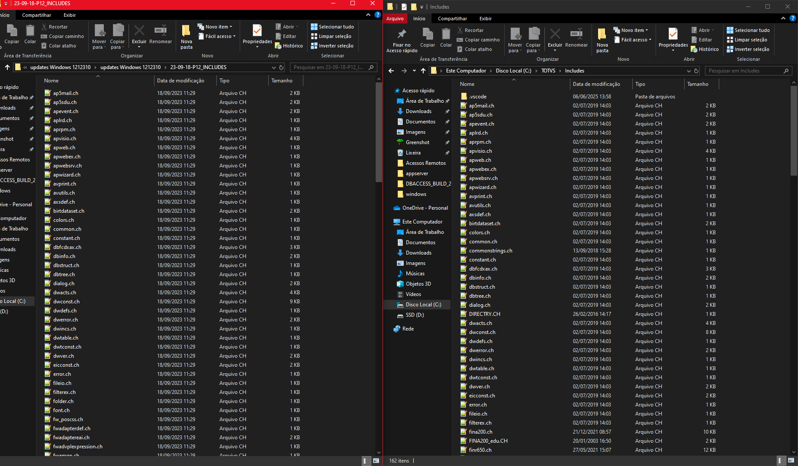

# Protheus-adm

## Configuração ambiente Protheus e Configuração Primeiro Acesso

Para fazer a configuração do ambiente e posteriormente o primeiro acesso, é necessário abrir o diretório de instalação do Protheus, sendo: **"C:\TOTVS\Protheus\P122210\Protheus\bin\appserver"** e abrir o arquivo **"appserver.ini"**

---

Com a abertura do arquivo serão, a primeira alteração será a mudança da tag referente ao nome do ambiente de **'enviroment'** para **'protheus'**.

Feito isso, será criada uma nova seção chamada **'dbaccess'**, adicionando as chaves:

- **database:**,
  Referente ao banco de dados do sistema, podendo ser informado como **"postgree"** ou **"sql"**.
- **server:**
  Referente ao servidor do DBAccess, por se tratar de um ambiente local de desenvolvimento, pode ser informado como **"localhost"**.
  **Obs: No caso o Protheus não realiza a comunicação direta com o banco de dados, é feita a comunicação entre o P12 e o DBAccess que por sua vez faz a comunicação com o banco de dados.**
- **port:**
  Referente a porta do DBAccess, não a porta do banco de dados, pode ser informado como **"7890"**.
- **alias:**
  Referente a alias ODBC criado, pode ser informado como **"protheus"**.

Feito isso será criada uma nova seção no final do arquivo chamada **'general'**, adicionando as chaves:

- **maxStringSize:**,
  Referente ao limite máximo de uma string, podendo ser informado como **"500"**.

Desta forma com as primeiras alterações o appserver.ini se encontra desta forma. Após as alterações, basta salvar o arquivo e reiniciar o serviço.

  

  

# Configuração primeiro acesso

Para fazer a configuração do primeiro acesso, é necessário abrir o diretório de instalação do Protheus, sendo: **"C:\TOTVS\Protheus\P122210\Protheus\bin\smartclient"** e abrir o arquivo **"appserver.ini"**

# Atualização binários

Para realizar a atualização dos binários, é necessário parar os serviço do LicenseServer e o DBAccess, acessar o diretórios diretórios, sendo:

**"Obs: Para realizar a atualização dos arquivos é recomendado manter uma cópia dos arquivos.ini"**

- AppServer

  Diretório AppServer Download: **"C:\Users\CR$\Downloads\Protheus\updates Windows 1212310\updates Windows 1212310\23-10-09-P12_APPSERVER_BUILD-20.3.2.1_WINDOWS_X64**"

  Diretório AppServer Máquina Local: **"C:\TOTVS\Protheus\P122210\Protheus\bin\appserver**"

  

  

- DBAccess

  Diretório DBAccess Download: **"C:\Users\CR$\Downloads\Protheus\updates Windows 1212310\updates Windows 1212310\23-10-09-P12_APPSERVER_BUILD-20.3.2.1_WINDOWS_X64**"

  Diretório DBAccess Máquina Local: **"C:\TOTVS\Protheus\P122210\TOTVSDBAccess\windows**"

  

  

**"Obs: É necessário realizar a cópia de um arquivo localizada no diretório, que deve ser copiada para o diretório do AppServer"**

---

Diretório DLL: **"C:\TOTVS\Protheus\P122210\TOTVSDBAccess\windows**"

  

Diretório AppServer: **"C:\TOTVS\Protheus\P122210\TOTVSDBAccess\windows**"

  

---

- Includes

  Diretório Includes Download: **"C:\Users\CR$\Downloads\Protheus\updates Windows 1212310\updates Windows 1212310\23-09-18-P12_INCLUDES**"

  Diretório Includes Máquina Local: **"C:\TOTVS\Includes**"

  

---

    Desenvolvido e documentado por: Cristian Gustavo
    Data início: 12/04/2024

Configurações de Ambiente e Primeiro Acesso
