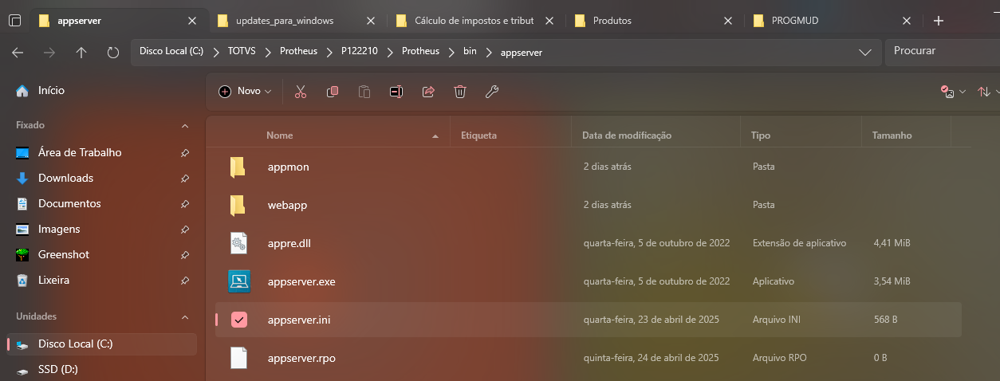
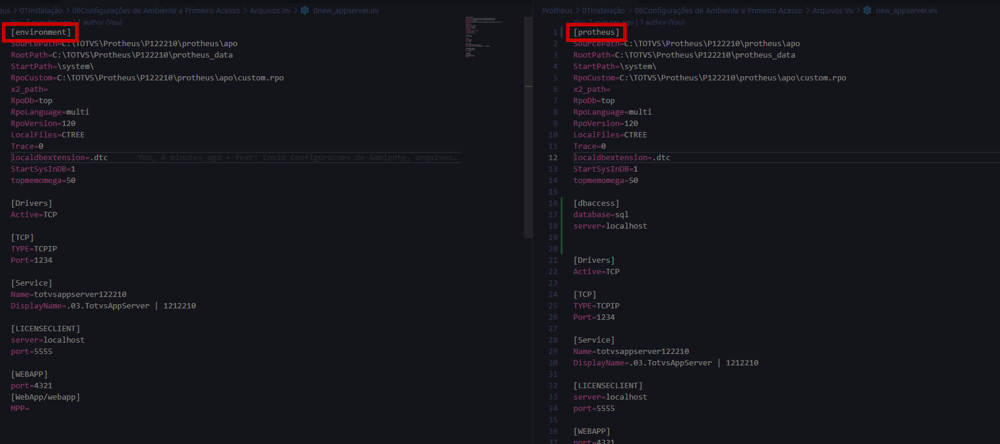
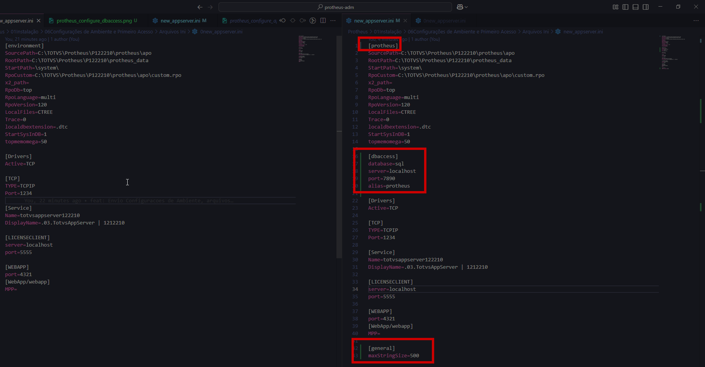
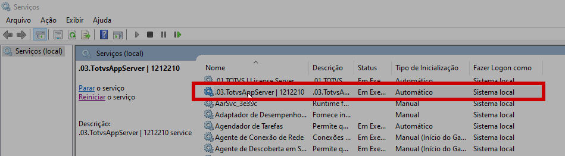
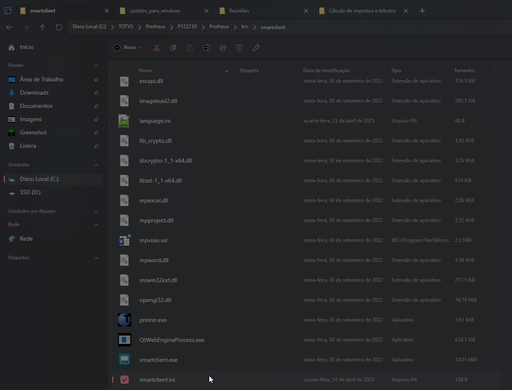

# Protheus-adm

## Configuração ambiente Protheus e Configuração Primeiro Acesso

Para fazer a configuração do ambiente e posteriormente o primeiro acesso, é necessário abrir o diretório de instalação do Protheus, sendo: **"C:\TOTVS\Protheus\P122210\Protheus\bin\appserver"** e abrir o arquivo **"appserver.ini"**

---

Com a abertura do arquivo serão, a primeira alteração será a mudança da tag referente ao nome do ambiente de **'enviroment'** para **'protheus'**.

Feito isso, será criada uma nova seção chamada **'dbaccess'**, adicionando as chaves:

- **database:**,
  Referente ao banco de dados do sistema, podendo ser informado como **"postgree"** ou **"sql"**.
- **server:**
  Referente ao servidor do DBAccess, por se tratar de um ambiente local de desenvolvimento, pode ser informado como **"localhost"**.
  **Obs: No caso o Protheus não realiza a comunicação direta com o banco de dados, é feita a comunicação entre o P12 e o DBAccess que por sua vez faz a comunicação com o banco de dados.**
- **port:**
  Referente a porta do DBAccess, não a porta do banco de dados, pode ser informado como **"7890"**.
- **alias:**
  Referente a alias ODBC criado, pode ser informado como **"protheus"**.

Feito isso será criada uma nova seção no final do arquivo chamada **'general'**, adicionando as chaves:

- **maxStringSize:**,
  Referente ao limite máximo de uma string, podendo ser informado como **"500"**.

Desta forma com as primeiras alterações o appserver.ini se encontra desta forma. Após as alterações, basta salvar o arquivo e reiniciar o serviço.

  

  

# Configuração primeiro acesso

Para fazer a configuração do primeiro acesso, é necessário abrir o diretório de instalação do Protheus, sendo: **"C:\TOTVS\Protheus\P122210\Protheus\bin\smartclient"** e abrir o arquivo **"appserver.ini"**

# Referência

- **Download TOTVS License Windows**

O arquivo pode ser baixado pelo site [TOTVS License](https://drive.google.com/file/d/1nR_ueegSh1lzCeiVSmcjQxxO96ePn7X5/view?usp=drive_link)

- **Download TOTVS instalador Windows**

O arquivo pode ser baixado pelo site [TOTVS instalador Windows](https://drive.google.com/file/d/1DATPRFPiTrb0u5rHqUh5UgSIQWaXDxV9/view?usp=drive_link)

- **Download pacote com atualizações**
  O arquivo pode ser baixado pelo site [pacote com atualizações](https://drive.google.com/file/d/160os2AURcOAodaER7n3dQTUEgjDHPWK9/view?usp=drive_link)

- **Download pacote com atualizações**
  Documentação configuração [Como Instalar e Configurar o Protheus 12.1.23 – Lobo Guará – Parte 2](https://protheusadvpl.com.br/como-instalar-e-configurar-o-protheus-12-1-23-lobo-guara-parte-2/)

---

    Desenvolvido e documentado por: Cristian Gustavo
    Data início: 12/04/2024

Configurações de Ambiente e Primeiro Acesso
