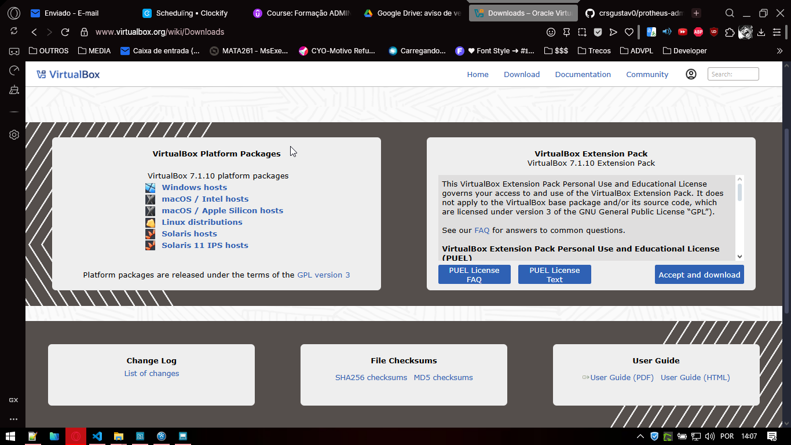
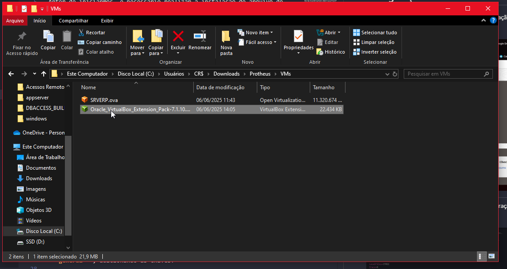
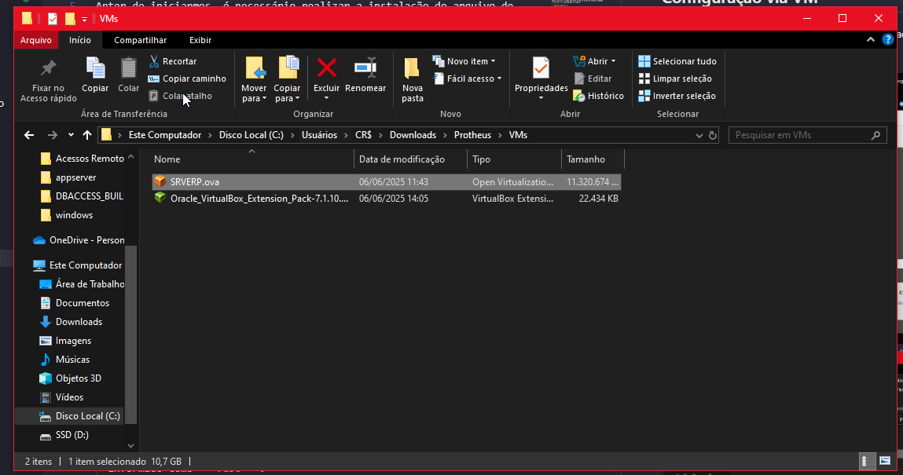
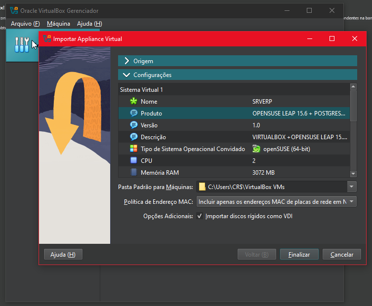
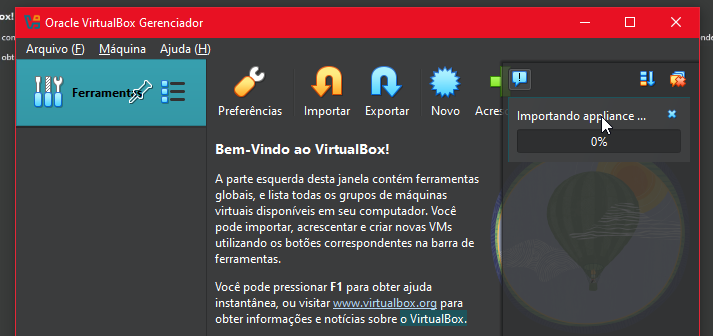
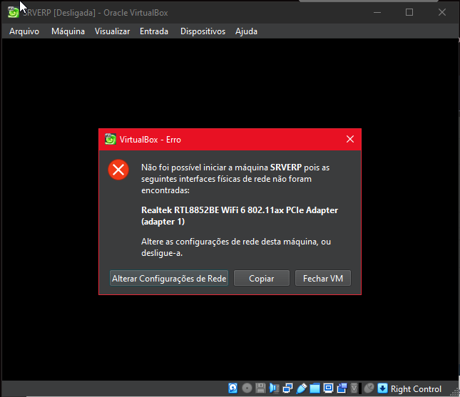
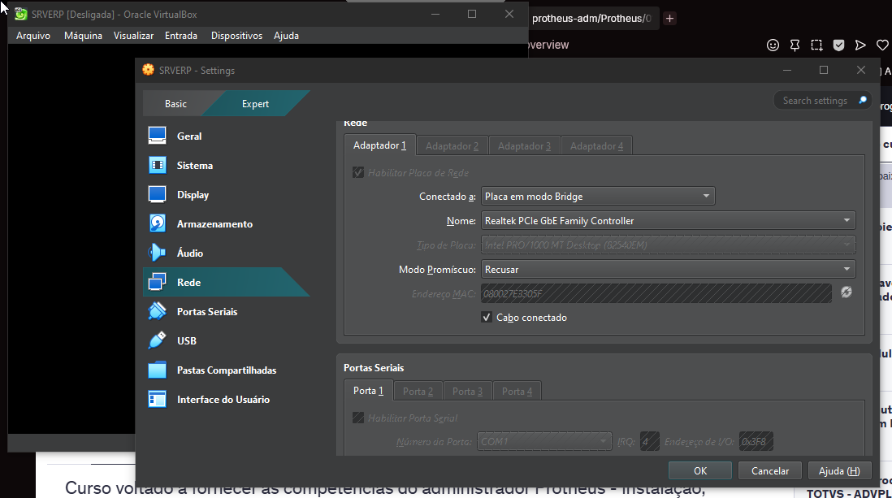
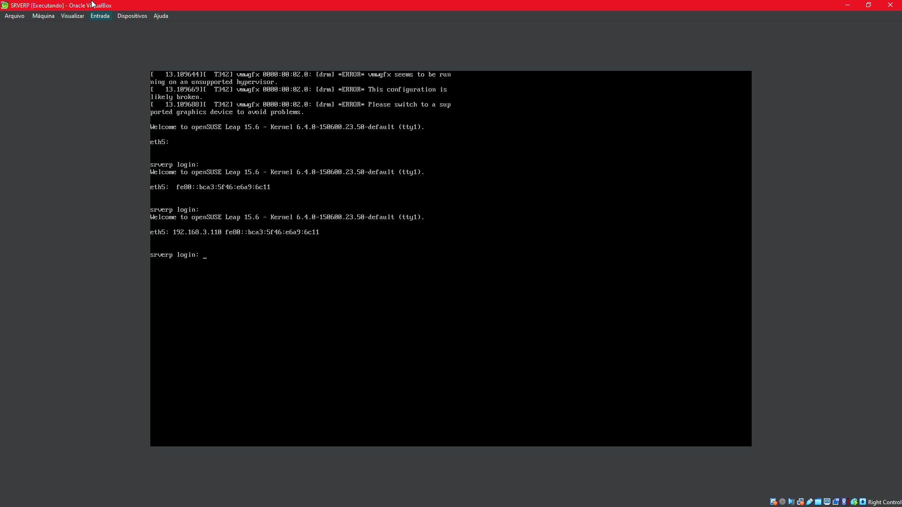
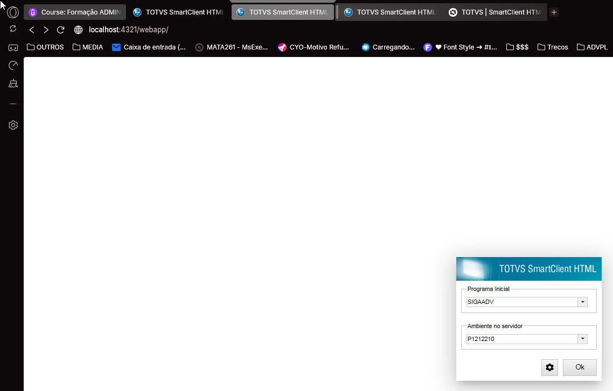
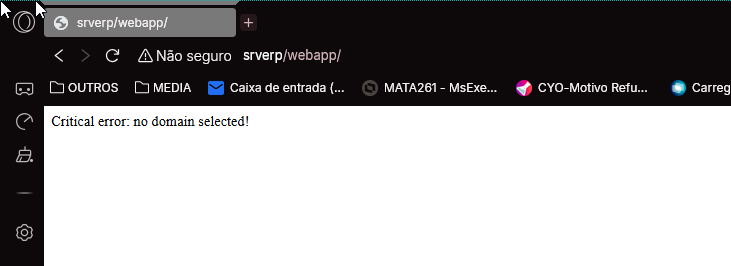

# Protheus-adm

## Configuração via VM

Anter de iniciarmos, é necessário realizar a instalação do arquivo de Extensão da VirtualBox, sendo disponibilizado no site.

---

Após a instalação da extensão é possível prosseguir com a instalação do Protheus via Máquina Virtual, sendo necessário clicar sobrea opção **"Importar"** na tela inicial.

Diretório Arquivo VM: **"C:\Users\CR$\Downloads\Protheus\VMs"**

**"Obs: Ao confirmar a operação será exibida uma mensagem avisando sobre o uso da VM, ressaltando que essa versão não deverá ser utilizada no ambiente de produção."**

---

Quando iniciar a máquina virtual uma mensagem de erro é exibida, no caso quando o local de exportação do arquivo da VM não é igual a local aonde ele foi instalado.

Para realizar a correção desse erro, basta apertar sobre a opção **"Alterar Configurações de Rede"** em seguida com a tela aberta, aperte sobre a opção **"OK"**.

Ao finalizar o processo é necessário acessar o endereço **"http://localhost:4321/webapp/"**, podendo retornar a seguinte tela com erro, por conta da máquina tentar acessar o endereço sem o "HTTPS", sendo **"https://localhost:4321/webapp/"**:

Retorno erro primeiro acesso:

---

Feito isso, será criada uma nova seção chamada **'dbaccess'**, adicionando as chaves:

- **database:**,
  Referente ao banco de dados do sistema, podendo ser informado como **"postgree"** ou **"sql"**.
- **server:**
  Referente ao servidor do DBAccess, por se tratar de um ambiente local de desenvolvimento, pode ser informado como **"localhost"**.
  **Obs: No caso o Protheus não realiza a comunicação direta com o banco de dados, é feita a comunicação entre o P12 e o DBAccess que por sua vez faz a comunicação com o banco de dados.**
- **port:**
  Referente a porta do DBAccess, não a porta do banco de dados, pode ser informado como **"7890"**.
- **alias:**
  Referente a alias ODBC criado, pode ser informado como **"protheus"**.

Feito isso será criada uma nova seção no final do arquivo chamada **'general'**, adicionando as chaves:

- **maxStringSize:**,
  Referente ao limite máximo de uma string, podendo ser informado como **"500"**.

Desta forma com as primeiras alterações o appserver.ini se encontra desta forma. Após as alterações, basta salvar o arquivo e reiniciar o serviço.

  

  

# Configuração primeiro acesso

Para fazer a configuração do primeiro acesso, é necessário abrir o diretório de instalação do Protheus, sendo: **"C:\TOTVS\Protheus\P122210\Protheus\bin\smartclient"** e abrir o arquivo **"appserver.ini"**

# Referência

- **Download VirtualBox Extension Pack**

Download [VirtualBox Extension Pack](https://download.virtualbox.org/virtualbox/7.1.10/Oracle_VirtualBox_Extension_Pack-7.1.10.vbox-extpack)

---

    Desenvolvido e documentado por: Cristian Gustavo
    Data início: 12/04/2024

Configurações de Ambiente e Primeiro Acesso
