# Protheus-adm

## Instalação do VSCode e Plugin para Desenvolvimento ADVPL

Anter de iniciarmos, é necessário realizar a instalação do Visual Studio Code e o plugin TOTVS Developer Studio, para que seja possível compilar os fontes do Protheus pelo VSCode, sendo disponibilizado nos sites.

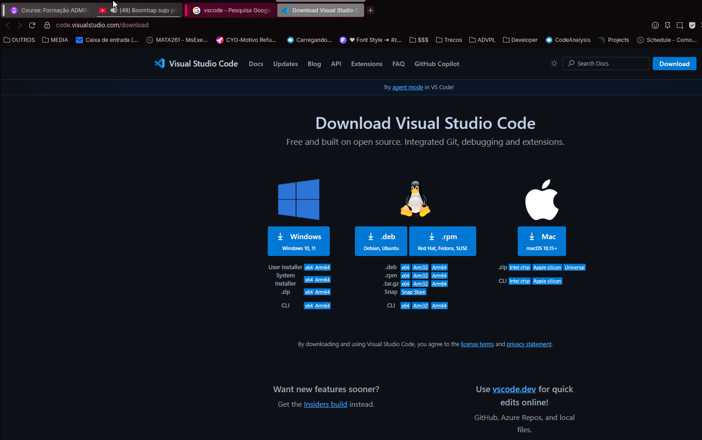

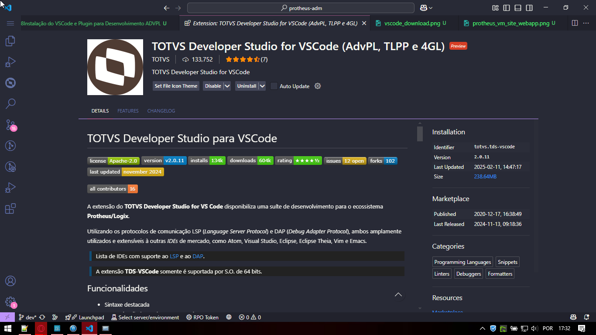

# Conectar VSCode ao ERP Protheus

Para realizar a conexão do VSCode com o Protheus, é necessário adiciocar uma nova conexão, sendo:

- **DEV-P12**,
  Referente ao nome da conexão.
- **localhost:**
  Referente ao enredeço do servidor do DBAccess, por se tratar de um ambiente local de desenvolvimento, pode ser informado como **"localhost"** ou endereço IP do servidor.
- **1234:**
  Referente a porta da seção **"TCP"** do AppServer, pode ser informado como **"1234"**.
- **Includes:**
  Referente ao diretório dos arquivos Includes do Protheus, pode ser informado como **"C:\TOTVS\Includes"**.

  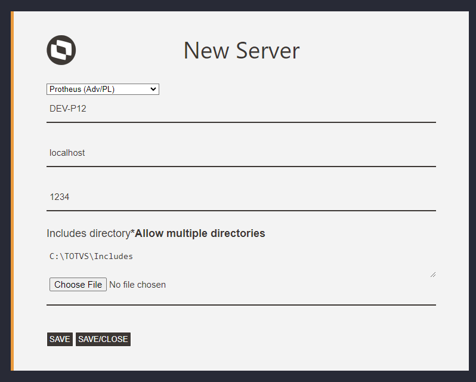

  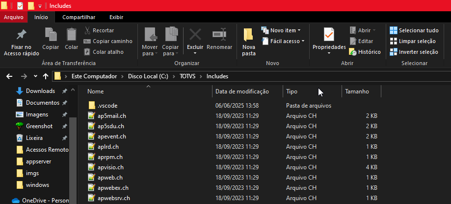

  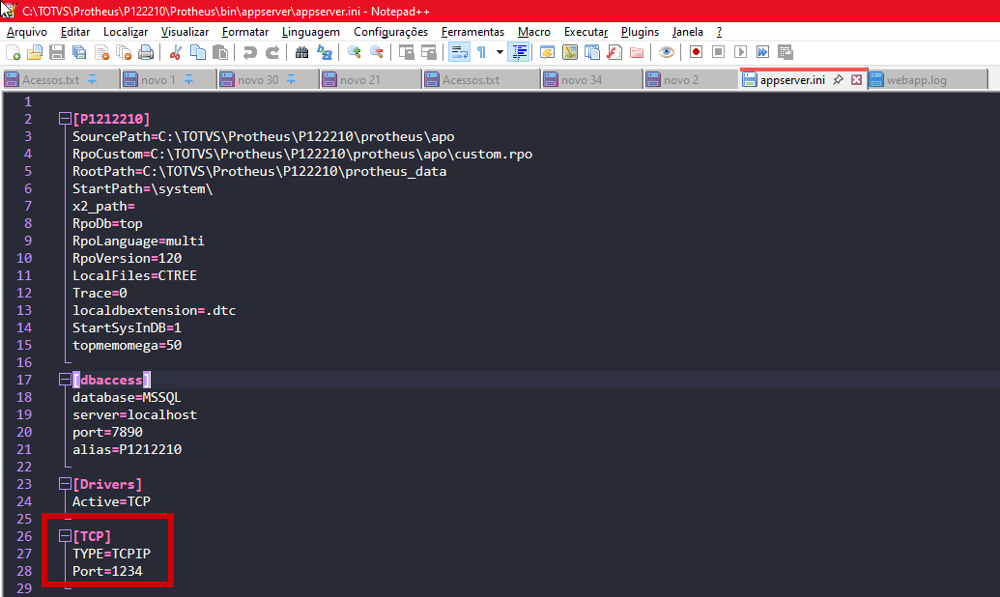

Após salvar as configurações, basta conectar, informe o nome do ambiente criado no arquivo AppServer, em seguida o usuário como **"admin"** e sua senha como vazio, **""**.

  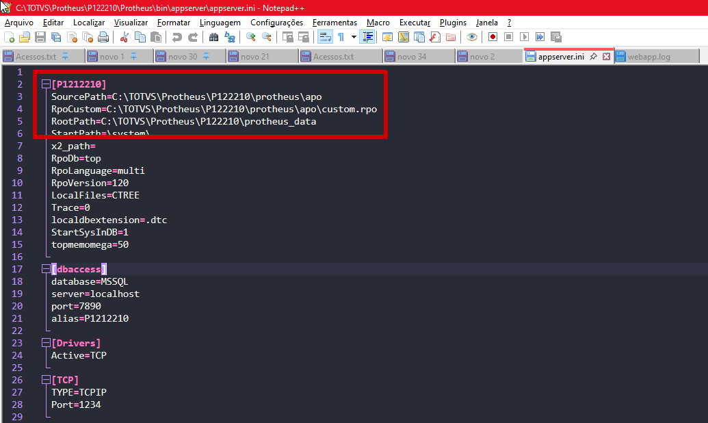
  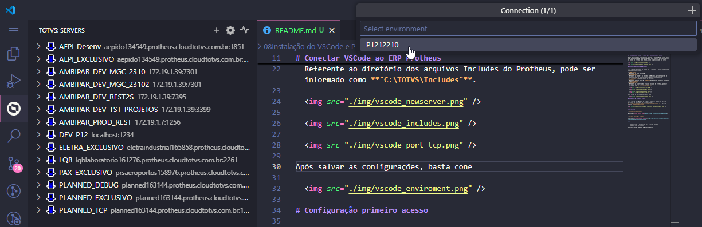

  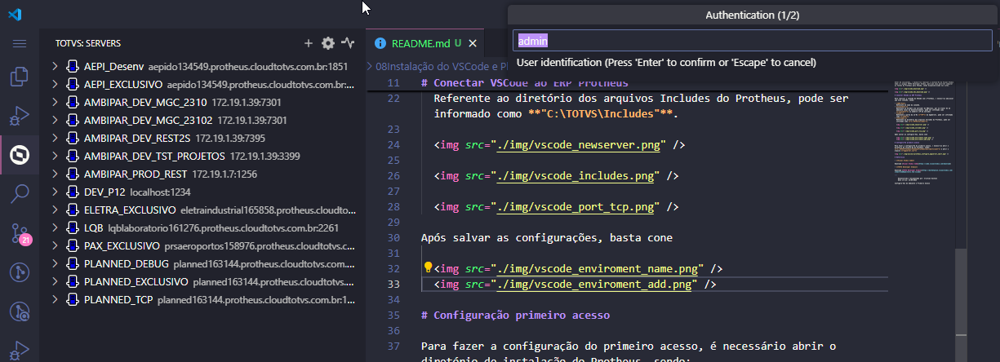
  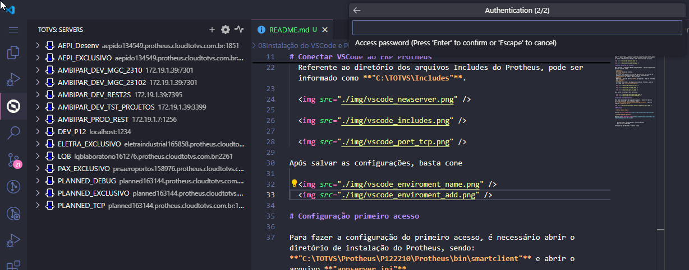
  

# Configurações Debug VSCode

Para visualizar configurações relaciodadas dos ambientes conectados, basta acessar o ícone na lateral.

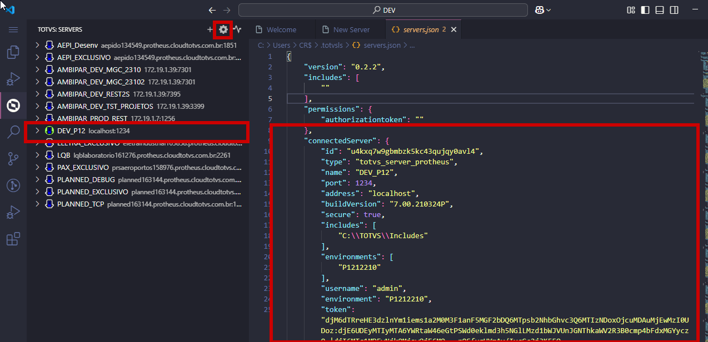

## Debug VSCode

Para visualizar configurações relaciodadas dos ambientes conectados, basta acessar o ícone na lateral, para que seja possível a conexão do ambiente via depuração, é necessário informar a tag **"enableMultiThread"** e alterando o diretório para o endereço do executável do Protheus.

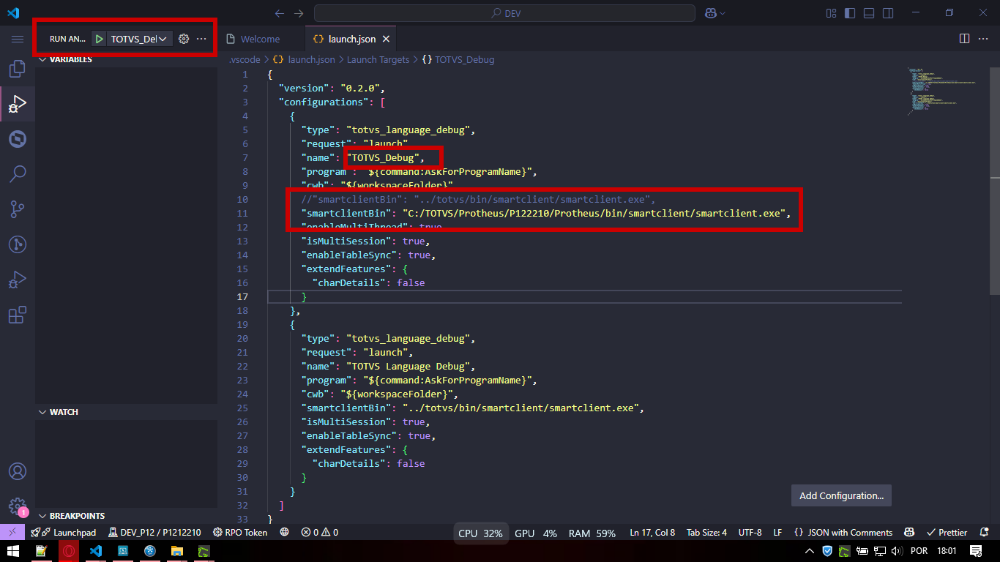

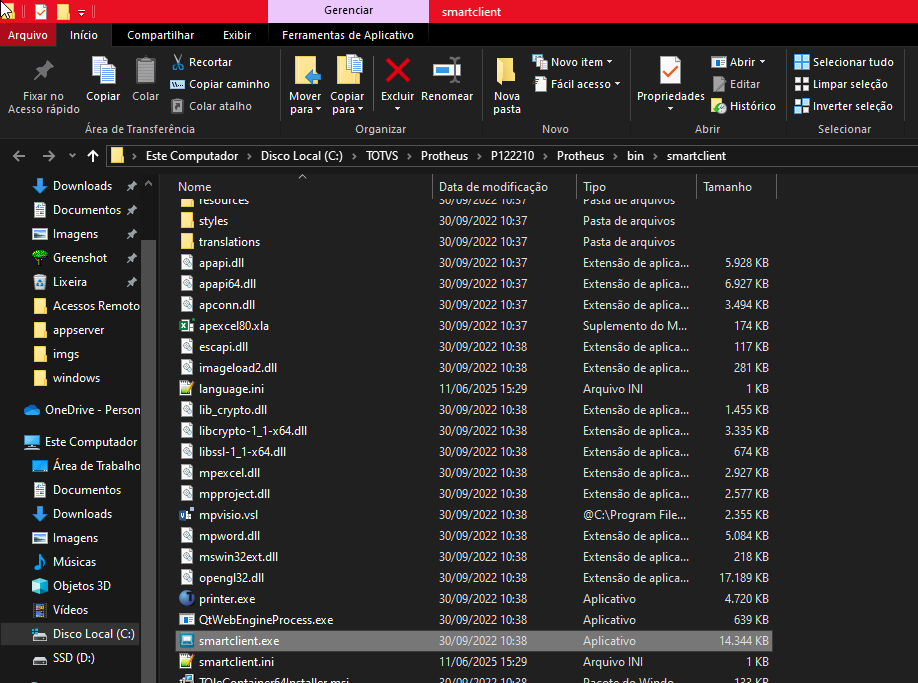

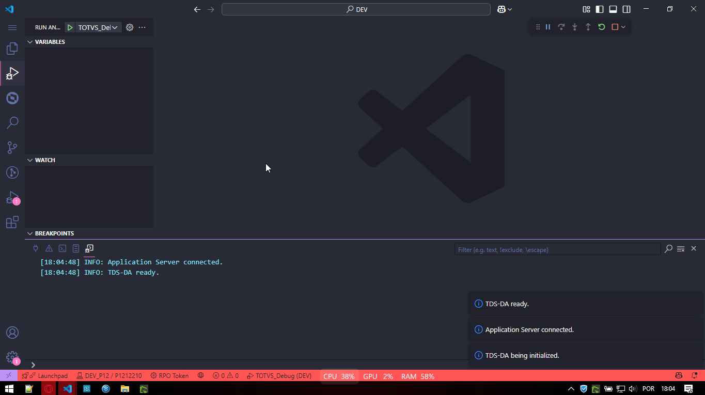

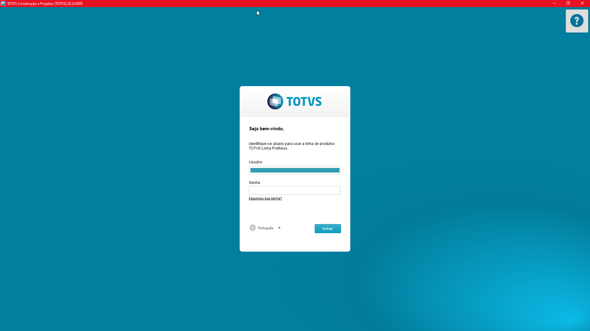

# Referência

- **Visual Studio Code**

Download [Visual Studio Code](https://code.visualstudio.com/download)

- **TOTVS Developer Studio**

Download [TOTVS Developer Studio](https://marketplace.visualstudio.com/items?itemName=totvs.tds-vscode)

---

    Desenvolvido e documentado por: Cristian Gustavo
    Data início: 12/04/2024

Configurações de Ambiente e Primeiro Acesso
