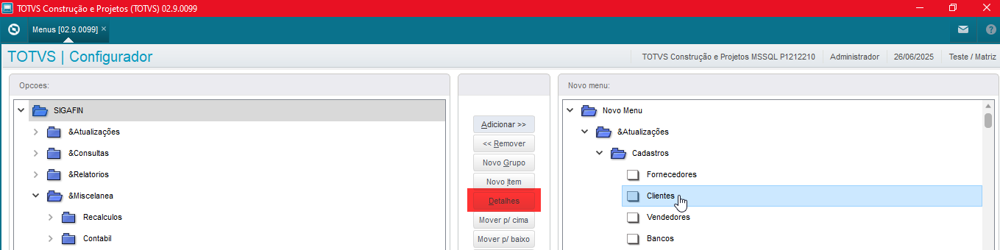
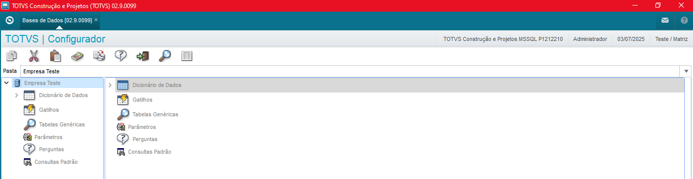
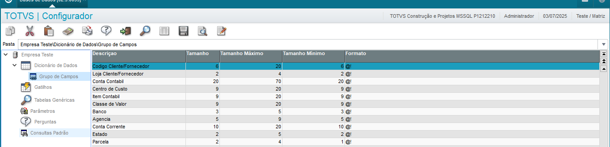
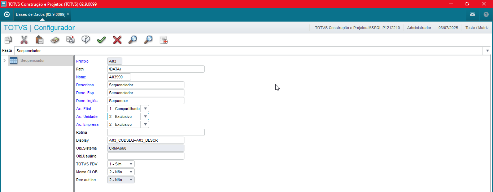
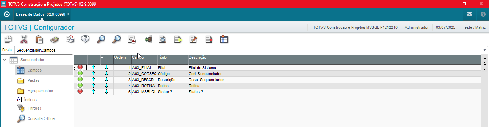

# Protheus-adm

## Configurador: Cadastro de Tabelas

Para fazer acessar a seção de Base de Dados, é necessário seguir o caminho: "**Base de Dados -> Dicionários -> Base de Dados**"

Possível visualizar as seguintes opções, sendo:

- **Dicionário de Dados:** Aonde são cadastrados os campos e tabelas do banco de dados do Protheus.
- **Gatilhos:** Cadastro de eventos via preenchimento de campos.
- **Tabelas Genéricas:** Tabelas usadas como banco de opções via seleções de campos.
- **Parâmetros:** Retornos externos utilizados para o uso interno no Protheus
- **Perguntas:** Modelos para telas para o preenchimento de parâmetros.
- **Consultas Padrão:** Semelhante ao Tabela Genérica, mas com o acesso de outra tabela via rotina, consulta.

**OBS: Na seleção da opção "Dicionário de Dados" é possível acessar o sub-item "Grupo de Campos", sendo possível visualizar campos organizados pela padronização da sua estrutura**

---

Selecionando a tabela **"AO3 - Sequenciador"** é possível visualizar as seguintes opções, sendo:

- **Prefixo:** Apelido da tabela.
- **Path:** Opção inutilizada por conta do Protheus não trabalhar mais com arquivos locais.
- **Nome:** Nome da tabela, sendo composto por **Prefixo Tabela** + **Grupo Empresa** + **Caracter reservado "0"**
- **Descrição:** Descrição em português, inglês e espanhol.
- **Acessos:** Operação visualizar.
  - **Ac. Filial:** Tendo opções **"Compartilhado"** ou **"Exclusivo"**.
  - **Ac. Unidade:** - **Ac. Filial:** Tendo opções **"Compartilhado"** ou **"Exclusivo"**.
  - **Ac. Empresa:** - **Ac. Filial:** Tendo opções **"Compartilhado"** ou **"Exclusivo"**.

**OBS: Caso informado "Compartilhado" significa que o registro criado para aquela filial estará disponíveis para outras tabelas, da mesma forma "Exclusivo" estará disponível apenas para sua filial de criação, assim o mesmo para as opções "Ac. Unidade" e "Ac. Empresa".**

- **Rotinas:** Sem uso.
- **Display:** Uso em MVC.
- **Obj. Sistema:** Objeto que fará a manipulação da tabela.
- **TOTVS PDV:** Opção para disponibilizar para o TOTVS PDV.
- **Memo CLOB:** Opção para uso de campo MEMO.

## Cadastro de Campos

Ainda posicionado na tabela **"AO3 - Sequenciador"** ao selecionar a opção **"Campos"**, os campos com **legenda verde** a sua ordem pode ser alterado via Configurador, campos com **legenda vermelha** não é possível a movimentação.

  

Ao selecionar a opção **"Editar"**, sobre um campo é possível visualizar as seguintes informações, sendo:

- **Usuário**,
  Referente ao nome do Usuário, pode ser informado como **"dev"**.
- **Nome Completo:**
  Referente ao nome do Usuário, pode ser informado como **"dev"**.**"Senha"** Referente a senha de acesso, pode ser informado como **"1"**.

  **Obs: na opção de Regras de acesso por grupo possuímos três opções de preenchimento, sendo**

  - **"1 - Priorizar "**: Definir uma lista de grupo que o usuário fará parte, sendo necessário informar quais grupo serão utilizados para a configurações dos acessos.
  - **"2 - Desconsiderar"**: Todos os acessos adicionados a aquele usuário serão considerados, **desconsiderando** os acessos por grupo.
  - **"3 - Somar"**: Caso vários grupo forem informados no cadastro do usuário e um destes incluir um item de um determinado menu, o usuário terá acesso também ao item.

Fazendo a alteração desta opção para **"Priorizar"** e em seguida informar o usuário **"Admnistrador"** e a opção **"Prioriza"** como **"Sim"**, desta forma toda a parte de configuração de acessos, módulos serão mantidas a partir do usuário selecionado.

Na seção de **"Restrições de acesso"** ao informar a empresa **"99 - TESTE"** somente **e não especificar a empresa, o usuário terá acesso a todas empresas, filiais pertencentes a esse grupo**.

Caso queira restringir o acesso do usuário para somente uma filial, basta informar na seção **"Filial do sistema"** a filial desejada, ou caso a liberação for feita para todas as filiais, basta apertar sobre a opção **"Todas as empresas"**.

## Ambientes

Ao acessar a aba **"Ambientes"** é possível ver todos os menus disponíveis para o usuário acessar.

**Caso queria informar um novo menu criado basta selecionar um módulo desejado e novamente sobre a opção dentre as opções exibidas.**

## Acessos

Ao acessar a aba **"Acessar"** é possível ver todos as operações disponíveis para o usuário.

**Caso queria marcar todas as opções basta selecionar o opção "Marca/Desmarca todos".**

**Somente um ponto de atenção, nas opções "171","172" e "173", caso selecionadas, o usuário em questão caso for um Administrador terá acesso tanto ao Módulo Configurador quanto ao MPSDU.**

## Parametrização

Ao acessar a aba **"Parametrização"** é possível ver todos as operações disponíveis para o usuário.

Caso for necessário fazer a liberação do usuário a mudança de data, operações com data retroativas, basta informar a opção **"Configurar dias de troca da data base"** e informar a quantidade.

---

Ao acessar a aba **"Impressão"** serão alterados a opção **"Diretório de impressão padrão"** para **"C:\Temp\"** e opção **"Ambiente de impressão padrão"** para **"2 - Cliente"**.

Feito todo o processo de configuração para a criação de um novo usuário, basta apertar sobre a opção **"Confirmar"**.

Para testar o acesso ao usuário, basta acessar novamente o ambiente, informando as credenciais sendo:

- **Usuário:** "dev"
- **Senha:** "1"

# Referência

- **Visual Studio Code**

Download [Visual Studio Code](https://code.visualstudio.com/download)

- **TOTVS Developer Studio**

Download [TOTVS Developer Studio](https://marketplace.visualstudio.com/items?itemName=totvs.tds-vscode)

---

    Desenvolvido e documentado por: Cristian Gustavo
    Data início: 12/04/2024

Configurações de Ambiente e Primeiro Acesso
