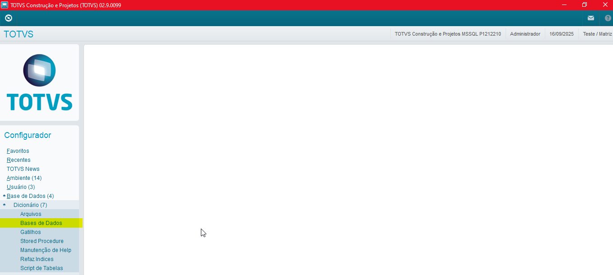
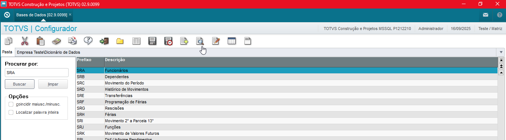
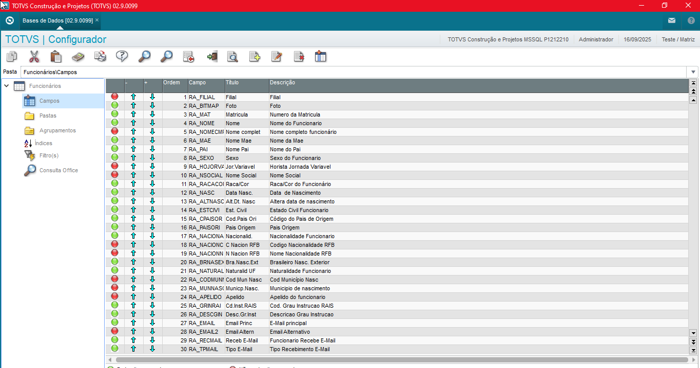
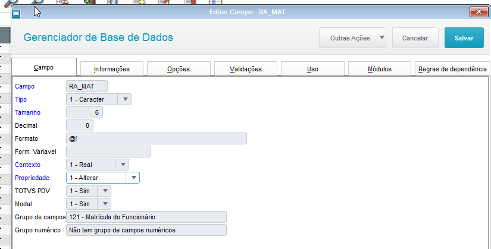
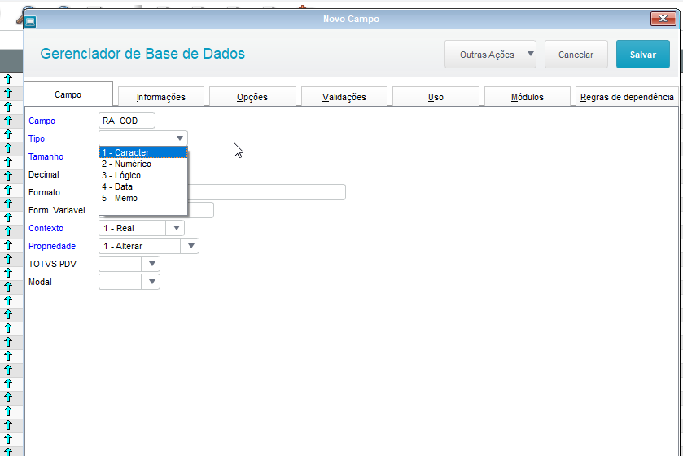
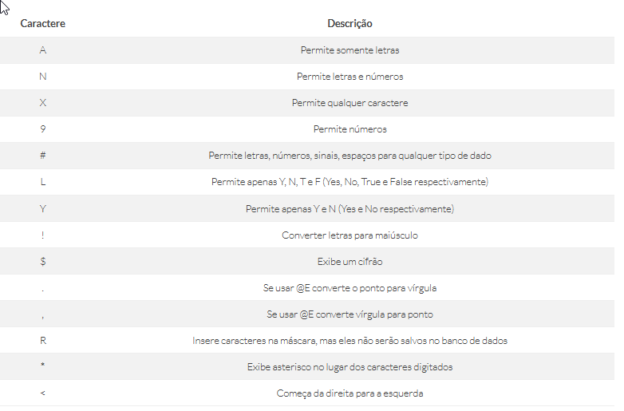
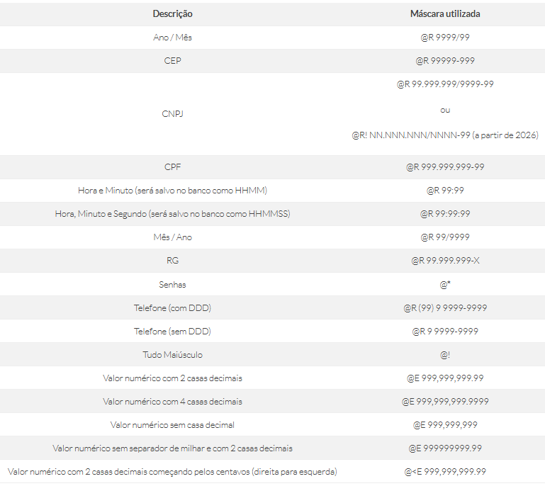

# Protheus-adm

## Configurador: Cadastro de Campos

Para fazer a inclusão de novos itens no Menu Protheus, é necessário seguir o caminho: "**Base de Dados -> Dicionários -> Base de Dados**"

Feito a abertura da tabela **"SRA - Tabela de Funcionários"**, ao selecionar a opção **"Campos"** é possível visualizar todos os campos da tabela, sendo:

- **Cor:** Em caso de **"verde"** pode ser alterado a ordem do campo, caso **"vermelho"** não pode ser alterado.

## Cadastro de Campos

Nesse exemplo será feito a criação de um novo campo na tabela **"SRA - Funcionários"**, sendo:

  

- **Campo**,
  Nome do campo, informado como **"RA_COD"**.
- **Tipo:**
  Referente ao tipo de campo, tendo como opções:
  

  - **Caracter:** Campo tipo texto suportando até 254 caracteres.
  - **Númerico:** Campo númerico considerando números inteiros e com casas decimais.

**Obs: Se houver decimais, é obrigatório usar o prefixo @E**

**O caractere separador de Millar (opcional) deve ser coma e o separador decimal deve ser o ponto.**

- **Lógico:** Campo lógico, criando um campo selecionável com as opções **".T. = True" e ".F. = False"**.
- **Memo:** Campo tipo texto suportando até 350 caracteres.

- **Decimal:**
  Referente ao número de casas decimais de nome campo tipo númerico.
- **Formato:**
  Referente ao nome do Usuário, pode ser informado como **"dev"**.**"Senha"** Referente a senha de acesso, tendo como exemplo.

Exemplos máscaras campos:

- **Form. Variável:**
  Referente ao nome do Usuário, pode ser informado como **"dev"**.**"Senha"** Referente a senha de acesso, pode ser informado como **"1"**.
- **Contexto:**
  Referente ao nome do Usuário, pode ser informado como **"dev"**.**"Senha"** Referente a senha de acesso, pode ser informado como **"1"**.

# Referência

- **Visual Studio Code**

Mascáras campos [Terminal de Informação](https://terminaldeinformacao.com/2023/08/29/principais-mascaras-pictures-usadas-no-protheus)

- **TOTVS Developer Studio**

Mascáras campos [TDN Español](https://tdn.totvs.com/display/teces/Picture+de+los+Campos)

---

    Desenvolvido e documentado por: Cristian Gustavo
    Data início: 12/04/2024

Configurações de Ambiente e Primeiro Acesso
